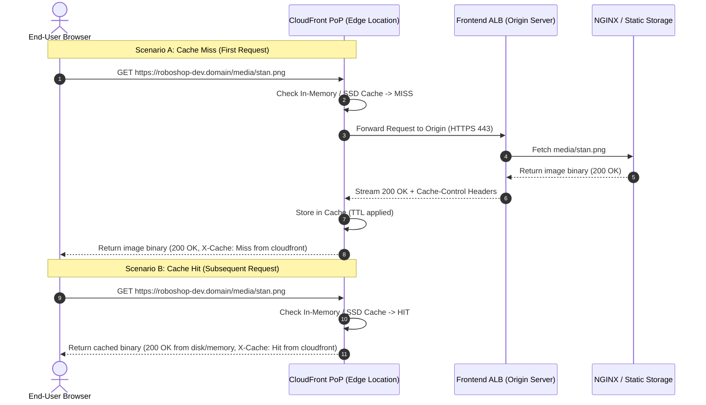

# Saturday, 28 March 2026
# Session 47 - AWS CloudFront CDN: Manual Architecture, Cache Behaviors, Invalidations & Production Terraform Implementation (`95-cdn`)
## Comprehensive Class Notes, Edge Network Architecture & Hands-on Guide

---

## Table of Contents
1. [Class Running Notes & Foundational Concepts](#1-class-running-notes--foundational-concepts)
   - [Original Running Notes & Core Architecture Analogies](#original-running-notes--core-architecture-analogies)
   - [CDN Fundamentals: Latency, Bandwidth & Edge Caching](#cdn-fundamentals-latency-bandwidth--edge-caching)
   - [HTTP Methods & Caching Strategy Matrix](#http-methods--caching-strategy-matrix)
   - [Cache Invalidation Life Cycle & Cost Implications](#cache-invalidation-life-cycle--cost-implications)
   - [Reverse Proxy (ALB/CDN) vs Forward Proxy (Corporate VPN)](#reverse-proxy-albcdn-vs-forward-proxy-corporate-vpn)
   - [Why Directory Naming is `95-cdn` Instead of `100-cdn` (Bash Lexicographical Sort Gotcha)](#why-directory-naming-is-95-cdn-instead of-100-cdn-bash-lexicographical-sort-gotcha)
2. [Workspace Projects Mapping & Architecture](#2-workspace-projects-mapping--architecture)
   - [Directory Structure & Direct Workspace File Links](#directory-structure--direct-workspace-file-links)
   - [Architectural Mermaid & ASCII Diagrams](#architectural-mermaid--ascii-diagrams)
     - [A. End-to-End Traffic Flow: Client -> CloudFront Edge -> Frontend ALB -> Microservices](#a-end-to-end-traffic-flow-client---cloudfront-edge---frontend-alb---microservices)
     - [B. CloudFront Cache Hit vs Cache Miss Request Lifecycle](#b-cloudfront-cache-hit-vs-cache-miss-request-lifecycle)
     - [C. Ordered Cache Behaviors & Path Routing Logic](#c-ordered-cache-behaviors--path-routing-logic)
     - [D. Forward Proxy vs Reverse Proxy Architecture Comparison](#d-forward-proxy-vs-reverse-proxy-architecture-comparison)
3. [Original AWS Console Step-by-Step Guides (Preserved Verbatim)](#3-original-aws-console-step-by-step-guides-preserved-verbatim)
   - [How to Configure AWS CloudFront Manually?](#how-to-configure-aws-cloudfront-manually)
   - [How to Configure AWS CloudFront Behaviour Manually?](#how-to-configure-aws-cloudfront-behaviour-manually)
   - [Create Invalidation Workflow & Developer Collaboration Notes](#create-invalidation-workflow--developer-collaboration-notes)
   - [How to Create Route53 Record for AWS CloudFront URL Manually?](#how-to-create-route53-record-for-aws-cloudfront-url-manually)
4. [Chronological Hands-on Execution & Deployment Process](#4-chronological-hands-on-execution--deployment-process)
   - [Step 1: Manual CDN Deployment & Route53 Alias Binding](#step-1-manual-cdn-deployment--route53-alias-binding)
   - [Step 2: Browser Verification & Memory Cache Inspection](#step-2-browser-verification--memory-cache-inspection)
   - [Step 3: The Production Bug – Registration Failure (`HTTP 403 Forbidden` on `POST`)](#step-3-the-production-bug--registration-failure-http-403-forbidden-on-post)
   - [Step 4: Root Cause Analysis – CloudFront Default Behavior HTTP Methods](#step-4-root-cause-analysis--cloudfront-default-behavior-http-methods)
   - [Step 5: Teardown Manual CDN & Route53 Records Before IaC](#step-5-teardown-manual-cdn--route53-records-before-iac)
   - [Step 6: Terraform Directory Scaffolding (`95-cdn`)](#step-6-terraform-directory-scaffolding-95-cdn)
   - [Step 7: Automated Deployment via Terraform CLI](#step-7-automated-deployment-via-terraform-cli)
   - [Step 8: End-to-End Verification of Static Asset Caching & Dynamic API Passthrough](#step-8-end-to-end-verification-of-static-asset-caching--dynamic-api-passthrough)
5. [End-to-End Line-by-Line Code Teardown (`95-cdn`)](#5-end-to-end-line-by-line-code-teardown-95-cdn)
   - [`provider.tf`: S3 State Locking & AWS Provider Configuration](#providertf-s3-state-locking--aws-provider-configuration)
   - [`data.tf`: AWS Managed Cache Policies & ACM Certificate SSM Retrieval](#datatf-aws-managed-cache-policies--acm-certificate-ssm-retrieval)
   - [`locals.tf`: Extracted Policy IDs & Centralized Tags](#localstf-extracted-policy-ids--centralized-tags)
   - [`variables.tf`: Parameterized Project, Environment & Hosted Zone](#variablestf-parameterized-project-environment--hosted-zone)
   - [`main.tf`: CloudFront Distribution & Route53 Alias Record Definition](#maintf-cloudfront-distribution--route53-alias-record-definition)
6. [Commands & CLI Reference Table](#6-commands--cli-reference-table)
7. [Official Documentation & Deep Technical References](#7-official-documentation--deep-technical-references)
8. [High-Yield Real-World Interview Questions & Deep Answers](#8-high-yield-real-world-interview-questions--deep-answers)
9. [Production Outage Case Study & Troubleshooting Playbook](#9-production-outage-case-study--troubleshooting-playbook)
10. [High-Impact LinkedIn Post Draft (Architecture & Gotchas)](#10-high-impact-linkedin-post-draft-architecture--gotchas)
11. [Session Metadata & Timestamps](#11-session-metadata--timestamps)

---

## 1. Class Running Notes & Foundational Concepts

### Original Running Notes & Core Architecture Analogies
*Captured directly from classroom discussions, interactive debugging scenarios, and architecture whiteboards:*

1. **4 Fundamental Checks when launching / debugging multi-tier infra**:
   - **Check 1: Security Group Rules**: Ingress & egress ports between layers (CloudFront -> ALB, ALB -> Frontend, Frontend -> Backend ALB, Backend -> DBs).
   - **Check 2: Ansible Roles Service Files**: Verify systemd unit configurations, working directory, application user, and environment variables.
   - **Check 3: Ansible Roles Host URLs / IPs**: Check port number and endpoint mappings across internal microservices.
   - **Check 4: NGINX Reverse Proxy Config**: Confirm `proxy_pass` targets clean HTTP Port 80 on ALB listeners without hardcoding port `:8080`.
2. **The Problem Statement – Geographic Latency & Origin Server Saturation**:
   - Origin server in **US (us-east-1)**, users accessing from **India**.
   - Round-trip time (RTT) for every static asset (HTML, CSS, JavaScript bundles, PNG/JPEG images) causes significant page-load lag (250ms–400ms per asset).
   - Sending high-volume repetitive GET requests for static assets directly to our backend Application Load Balancers and EC2 instances burns unnecessary EC2 compute bandwidth and drives up AWS egress costs.
3. **The Multi-Tier Caching Analogy**:
   - In application architectures:
     $$\text{Application} \longrightarrow \text{Database} \quad \text{vs} \quad \text{Application} \longrightarrow \text{Cache (Redis)} \longrightarrow \text{Database}$$
   - In web delivery:
     $$\text{Browser} \longrightarrow \text{Origin Server (ALB)} \quad \text{vs} \quad \text{Browser} \longrightarrow \text{CDN (Edge Server)} \longrightarrow \text{Origin Server}$$
4. **Definition of CDN (Content Delivery Network)**:
   - CDN is a globally distributed network of proxy/storage servers located in **AWS Edge Locations** across 400+ Points of Presence (PoPs) worldwide.
   - When a user requests content, the DNS resolves to the closest Edge Location geographically.
   - If the Edge location has the requested object in its cache (**Cache Hit**), it returns it in single-digit milliseconds without ever contacting the origin.
   - If the object is not present (**Cache Miss**), CloudFront fetches it from the configured Origin Server (Frontend ALB / S3 Bucket), serves it to the user, and caches it locally for subsequent requests until its TTL expires.
5. **Caching vs Non-Caching HTTP Methods**:
   - **`GET` / `HEAD`**: Safe and idempotent. Can and should be cached (media, product catalogs, FAQ, ratings, banners, `.js`, `.css`, `.png`).
   - **`POST` / `PUT` / `PATCH` / `DELETE`**: Mutating requests (creating user accounts, placing orders, processing payments). **Must NEVER be cached**. They must pass straight through CloudFront to the origin server.
6. **Cache Invalidation Concept**:
   - Static files stay in edge cache according to **TTL (Time to Live)**.
   - When developers deploy a new release with updated UI assets (e.g. modified `main.js` or new logo `stan.png`), edge locations would still serve stale data until TTL expires.
   - **Invalidation** forcefully evicts selected or all cached objects from all Edge servers worldwide. The next client request immediately forces a fresh fetch from the origin server.
7. **Production Example URLs in Roboshop**:
   - Static Media: `https://frontend-dev.daws88s.online/media/stan.png`
   - Graphs / UI Assets: `https://frontend-dev.daws88s.online/media/graph.png`
   - Cache pattern rule: `/media/*` and `/images/*` are explicitly routed to caching policies.
8. **Enterprise Traffic Hierarchy**:
   $$\text{Client Browser} \longrightarrow \text{DNS (Route 53)} \longrightarrow \text{CDN (AWS CloudFront)} \longrightarrow \text{Public ALB} \longrightarrow \text{NGINX Frontend} \longrightarrow \text{Private Backend ALB} \longrightarrow \text{NodeJS/Java Services} \longrightarrow \text{Databases}$$

---

### CDN Fundamentals: Latency, Bandwidth & Edge Caching

```
+──────────────────────────────────────────────────────────────────────────────────────────────────+
|                                    LATENCY & BANDWIDTH IMPACT                                    |
+──────────────────────────────────────────────────────────────────────────────────────────────────+

 WITHOUT CDN:
 [Client in Mumbai] ───(Over Atlantic/Pacific - 350ms RTT)───> [Origin ALB & EC2 in us-east-1]
   - High latency on every page navigation
   - Origin handles 100% of static asset bandwidth
   - Expensive AWS EC2 outbound data transfer ($0.09/GB)

 WITH AWS CLOUDFRONT CDN:
 [Client in Mumbai] ───(5ms RTT)───> [Edge Location in Mumbai/Hyderabad/Chennai]
                                            │
                                  [Cache Hit: 95% of traffic]
                                  Served instantly from Edge RAM/SSD!
                                            │
                                  [Cache Miss / Dynamic API]
                                            └──(AWS Global Fiber Backbone)──> [Origin in us-east-1]
```

CloudFront operates on AWS's private high-speed dedicated fiber backbone rather than traversing the public internet for edge-to-origin communication, significantly reducing packet loss and jitter even on dynamic cache misses.

---

### HTTP Methods & Caching Strategy Matrix

| HTTP Method | Idempotent? | Safe? | Default CloudFront Action | Recommended Roboshop Behavior |
| :--- | :--- | :--- | :--- | :--- |
| **`GET`** | Yes | Yes | Can be cached | Cached at Edge for `/media/*`, `/images/*`, `.css`, `.js` |
| **`HEAD`** | Yes | Yes | Can be cached | Cached at Edge |
| **`OPTIONS`** | Yes | Yes | Passthrough / Can be cached | Allowed for CORS preflight validation |
| **`POST`** | No | No | Passthrough (Must be allowed) | Bypasses cache directly to Origin (Registration, Cart, Login) |
| **`PUT`** | Yes | No | Passthrough (Must be allowed) | Bypasses cache directly to Origin (Update shipping address) |
| **`PATCH`** | No | No | Passthrough (Must be allowed) | Bypasses cache directly to Origin (Partial item quantity updates) |
| **`DELETE`** | Yes | No | Passthrough (Must be allowed) | Bypasses cache directly to Origin (Delete cart item) |

> [!CAUTION]
> **The Classic CloudFront 403 Pitfall**: When creating a CloudFront distribution via the AWS Console, the default allowed HTTP methods selection is often pre-selected as **"GET, HEAD"**. If this default behavior is left unchanged on your root distribution (`*`), any user attempting to Register, Login, or Add to Cart will receive an instant `HTTP 403 Forbidden` from CloudFront! The Default Behavior must ALWAYS allow **`GET, HEAD, OPTIONS, PUT, POST, PATCH, DELETE`**.

---

### Cache Invalidation Life Cycle & Cost Implications

When updating static files on the origin, CloudFront provides the **Invalidation** API:

```
+───────────────────────────+
| Developer pushes new code |
+─────────────┬─────────────+
              │
              ▼
+──────────────────────────────────────────────────────────+
| CI/CD Pipeline updates frontend assets on Origin server   |
+─────────────────────────────┬────────────────────────────+
              │
              ▼
+──────────────────────────────────────────────────────────+
| Trigger Invalidation:                                    |
|   aws cloudfront create-invalidation                     |
|     --distribution-id <DIST_ID> --paths "/*"             |
+─────────────────────────────┬────────────────────────────+
              │
              ▼
+──────────────────────────────────────────────────────────+
| CloudFront marks all cached objects across Edge PoPs     |
| as STALE / INVALIDATED                                   |
+─────────────────────────────┬────────────────────────────+
              │
              ▼
+──────────────────────────────────────────────────────────+
| Subsequent user request -> Forces fresh Cache Miss       |
| Origin serves new asset -> Edge re-populates cache       |
+──────────────────────────────────────────────────────────+
```

- **Cost Rule**: AWS provides **1,000 free invalidation paths per month**. Beyond 1,000 paths, AWS charges **$0.005 per path**.
- **Best Practice**: Invalidate `/*` (counts as 1 path) or use **Object Versioning** in URLs (e.g. `main.v2.3.1.js` or hash-based chunking `app.8f9b2c.js`). Object versioning requires zero invalidations and is completely free!

---

### Reverse Proxy (ALB/CDN) vs Forward Proxy (Corporate VPN)

Understanding the directional flow of proxies is a core DevSecOps interview topic:

```
FORWARD PROXY (Client-Facing / Outbound):
[Company Laptop] ──> [Corporate VPN / Forward Proxy] ──> [Public Internet / Bastion Host]
   • Client is aware of proxy configuration
   • Protects the client identity (anonymity / shared egress IP)
   • Enforces content filtering (blocks malicious sites, social media)
   • Enables compliance, session logging, and traffic auditing

REVERSE PROXY (Server-Facing / Inbound):
[External Client] ──> [CloudFront CDN / Application Load Balancer] ──> [Internal Microservices]
   • Client has NO awareness of internal infrastructure topology
   • Protects the servers (hides internal IPs, shields private subnets)
   • Provides SSL/TLS termination, DDoS protection (AWS Shield), and Web Caching
   • Routes requests based on path/host headers to target groups
```

---

### Why Directory Naming is `95-cdn` Instead of `100-cdn` (Bash Lexicographical Sort Gotcha)

In Session 46, we introduced the compound bash loop to initialize and apply our decoupled Terraform layers in sequential order:
```bash
for layer in $(ls -d */); do
  cd "$layer"
  terraform apply -auto-approve
  cd ..
done
```

In Unix/Linux shells, directory names are sorted **lexicographically (alphabetically)**, NOT numerically!
Consider the sorting order if we named the CDN directory `100-cdn`:
```
00-vpc/
10-sg/
100-cdn/   <--- CRITICAL BUG! 100 sorts immediately after 10!
20-sg-rules/
30-bastion/
...
```
If `100-cdn/` executes right after `10-sg/`, it attempts to look up SSM parameters for the Frontend ALB and ACM certificates that have **not even been created yet** (since `70-acm` and `80-frontend-alb` haven't run)!
By naming the folder **`95-cdn`**, it sorts cleanly after `90-components/`:
```
00-vpc/ -> 10-sg/ -> 20-sg-rules/ -> 30-bastion/ -> 40-databases/ -> 50-backend-alb/ -> 70-acm/ -> 80-frontend-alb/ -> 90-components/ -> 95-cdn/
```
This preserves deterministic, automated dependency orchestration.

---

## 2. Workspace Projects Mapping & Architecture

### Directory Structure & Direct Workspace File Links
The Terraform CDN layer is located in the `roboshop-infra-dev` repository:

```
/Users/sriramcharankolla/Desktop/DevOps/roboshop-infra-dev/
├── 00-vpc/
├── 10-sg/
├── 20-sg-rules/
├── 30-bastion/
├── 40-databases/
├── 50-backend-alb/
├── 70-acm/
├── 80-frontend-alb/
├── 90-components/
└── 95-cdn/                                      # AWS CloudFront CDN Infrastructure Layer
    ├── provider.tf                              # S3 remote backend & AWS provider v6.33.0
    ├── data.tf                                  # Managed cache policies & ACM cert SSM data
    ├── locals.tf                                # Policy IDs, tags & cert ARN lookup
    ├── variables.tf                             # Project, env, domain_name & Route53 zone_id
    ├── main.tf                                  # aws_cloudfront_distribution & Route53 A record
    └── README.md                                # Deployment documentation & architecture notes
```

- Clickable Workspace Links:
  - [roboshop-infra-dev/95-cdn/main.tf](../../roboshop-infra-dev/95-cdn/main.tf)
  - [roboshop-infra-dev/95-cdn/provider.tf](../../roboshop-infra-dev/95-cdn/provider.tf)
  - [roboshop-infra-dev/95-cdn/data.tf](../../roboshop-infra-dev/95-cdn/data.tf)
  - [roboshop-infra-dev/95-cdn/locals.tf](../../roboshop-infra-dev/95-cdn/locals.tf)
  - [roboshop-infra-dev/95-cdn/variables.tf](../../roboshop-infra-dev/95-cdn/variables.tf)

---

### Architectural Mermaid & ASCII Diagrams

#### A. End-to-End Traffic Flow: Client -> CloudFront Edge -> Frontend ALB -> Microservices

```mermaid
flowchart TD
    User([End User Browser]) -->|1. HTTPS DNS Query: roboshop-dev.domain| R53[AWS Route 53 DNS]
    R53 -->|2. Alias resolves to CloudFront Edge| CF[AWS CloudFront Edge Distribution]
    
    subgraph CloudFront Behaviors
        CF -->|Match /media/* or /images/*| CacheEngine{Edge Cache Store}
        CF -->|Match Default * API Requests| OriginPass[Origin Passthrough Policy]
    end
    
    CacheEngine -->|Cache Hit: Return 200 OK| User
    CacheEngine -->|Cache Miss: Fetch from Origin| FALB[Frontend Application Load Balancer]
    OriginPass -->|Direct Forward: POST/PUT/DELETE| FALB
    
    subgraph AWS VPC (us-east-1)
        FALB -->|Port 80| Nginx[Frontend EC2 Web Server]
        Nginx -->|Proxy Pass Port 80| BALB[Backend Internal ALB]
        BALB -->|Port 8080| Microservices[Catalogue / User / Cart / Shipping / Payment]
        Microservices --> DB[(MongoDB / Redis / MySQL / RabbitMQ)]
    end
```

#### B. CloudFront Cache Hit vs Cache Miss Request Lifecycle



#### C. Ordered Cache Behaviors & Path Routing Logic

```
+──────────────────────────────────────────────────────────────────────────────────────────+
|                       CLOUDFRONT CACHE BEHAVIOR PRECEDENCE TABLE                         |
+──────────────────────────────────────────────────────────────────────────────────────────+
  PRECEDENCE 0:  Path Pattern: /media/*
                 Allowed Methods: GET, HEAD, OPTIONS
                 Cached Methods: GET, HEAD, OPTIONS
                 Cache Policy: Managed-CachingOptimized (TTL: Default 1 day, Min 1s, Max 1y)
                 Origin: frontend-dev.<domain_name>
                 Result: FAST STATIC DELIVERY FROM EDGE

  PRECEDENCE 1:  Path Pattern: /images/*
                 Allowed Methods: GET, HEAD, OPTIONS
                 Cached Methods: GET, HEAD, OPTIONS
                 Cache Policy: Managed-CachingOptimized
                 Origin: frontend-dev.<domain_name>
                 Result: FAST STATIC DELIVERY FROM EDGE

  DEFAULT (*):   Path Pattern: Default (*)
                 Allowed Methods: GET, HEAD, OPTIONS, PUT, POST, PATCH, DELETE
                 Cached Methods: GET, HEAD
                 Cache Policy: Managed-CachingDisabled (Min/Default/Max TTL = 0)
                 Origin: frontend-dev.<domain_name>
                 Result: INSTANT PASSTHROUGH TO ORIGIN FOR ALL DYNAMIC APIs
```

#### D. Forward Proxy vs Reverse Proxy Architecture Comparison

```
+──────────────────────────────────────────────────────────────────────────────────────────+
|                        FORWARD PROXY vs REVERSE PROXY TOPOLOGY                           |
+──────────────────────────────────────────────────────────────────────────────────────────+

 FORWARD PROXY:
 [Internal Employees] ───> [Company VPN / Squid Proxy] ───> [Public Internet / Third Party]
       Client Knows: YES (Configured in OS/Browser)
       Server Knows: NO (Server only sees VPN IP)
       Primary Purpose: Anonymity, outbound URL filtering, data exfiltration prevention.

 REVERSE PROXY:
 [Public Internet / Users] ───> [CloudFront / NGINX / ALB] ───> [Internal Private Fleet]
       Client Knows: NO (Client thinks Reverse Proxy is the Web Server)
       Server Knows: YES (Server receives X-Forwarded-For headers)
       Primary Purpose: DDoS shielding, SSL termination, caching, load balancing.
```

---

## 3. Original AWS Console Step-by-Step Guides (Preserved Verbatim)

*The exact step-by-step console instructions recorded during manual validation are preserved below in their entirety:*

### How to Configure AWS CloudFront Manually?
> In AWS search bar search for “CloudFront” then click on “CloudFront” then click on “Create distribution” button then select “Pay as you go” option if showing plans along with “Pay as you go” option else if not showing plans and “Pay as you go” option then in “Get started” page under “Distribution options” enter “Distribution name”(roboshop-dev) then for “Distribution type” keep “Single website or app” option same then under “Domain” enter “Route 53 managed domain - optional”(your domain name like aitechapp.fun) then click on “Check domain” button then click on “Next” button then in “Specify origin” page then under “Origin type” select “Elastic Load Balancer” option for “Origin type” then under “Origin” enter “Elastic Load Balancing origin”(frontend-dev.<domain-name>) then under “Settings” select “Customize origin settings” option for “Origin settings” then select “Customize cache settings” option for “Cache settings” then select “HTTPS only” option for “Viewer protocol policy” then select “GET, HEAD, OPTIONS” option for “Allowed HTTP methods” then select “CachingOptimized” option for “Cache policy” then click on “Next” button then in “Enable security” page select “Do not enable security protections” option for “Web Application Firewall (WAF)” then click on “Next” button then in “Get TLS certificate” page then under “TLS certificate” select “ *.<domian-name> “ for “Available certificates” then click on “Next” button then click on “Create distribution” button. It will take 5 minutes and create CDN with AWS CloudFront.

### How to Configure AWS CloudFront Behaviour Manually?
> Select a distribution then click on “Create behavior” then under “Settings” enter “Path pattern”(/media/*) then for “Origin and origin groups” select your “frontend-dev.<domain-name-aws-generated-text” then select “GET, HEAD, OPTIONS” for “Allowed HTTP methods” then select “CachingOptimized” option for “Cache policy” then click on “Create behaviour” button. Here creating cache policy for Media for “Roboshop”. Similarly create behaviour for Images also. Here creating cache policy for Videos for “Roboshop”. Similarly create behaviour for Images also. Finally for “Default” for “Cache policy” select “CachingDisabled”, this means if /media/* , /images/* , /videos/* are not matching in user request URL then remaining thing no need to cache.

### Create Invalidation Workflow & Developer Collaboration Notes
> Create Invalidation -> it is used when we did changes in resources like images, videos or all resources then with “Create Invalidation” path we can clear all cache in application. `/*` to clear all cache and `/images/*` to clear images cache.
>
> **Note**: Allowed HTTP methods, Cache policy, Origin request policy, Response headers policy should be defined by developers. Cache policy should be discussed with Developer and need to setup Cache policy.

### How to Create Route53 Record for AWS CloudFront URL Manually?
> Go to AWS Route53 then click on DNS then select DNS then enter “Record name”(roboshop-dev) then toggle on “Alias” button then select “Alias to CloudFront distribution” option then select “AWS CloudFront URL” then click on “Create record” button. Then copy created DNS record URL then enter in the Browser then click on chrome inspection by mouse right click then click on any .png image in the “Network” tab then in Status code 200 you can find message like “(from memory cache)” then at “X-Amz-Cf-Id” value you will also see “CloudFront”.

---

## 4. Chronological Hands-on Execution & Deployment Process

The hands-on session followed a structured sequence: starting with manual provisioning in the AWS Console, discovering a critical production bug on user registration, performing root cause analysis, fixing the behavior, tearing down manual resources, and finally re-architecting everything cleanly into reusable Terraform IaC (`95-cdn`).

### Step 1: Manual CDN Deployment & Route53 Alias Binding
1. Provisioned the CloudFront distribution pointing to `frontend-dev.<domain_name>` as the Custom Origin over HTTPS (Port 443).
2. Set Viewer Protocol Policy to `HTTPS only`.
3. Created an Alias record in AWS Route 53 hosted zone pointing `roboshop-dev.<domain_name>` to the CloudFront distribution domain (`dxxxxxxxxxxxx.cloudfront.net`).

### Step 2: Browser Verification & Memory Cache Inspection
1. Navigated to `https://roboshop-dev.<domain_name>` in Google Chrome.
2. Opened Chrome Developer Tools (`F12` or Right Click -> **Inspect** -> **Network** tab).
3. Filtered by `Img` and observed static resources like `stan.png` or `graph.png`.
4. On the second request, verified:
   - **Size**: `(from memory cache)` or `(from disk cache)`
   - **HTTP Response Headers**:
     - `X-Cache: Hit from cloudfront`
     - `X-Amz-Cf-Id: <unique-request-id>`
     - `Via: 1.1 <id>.cloudfront.net (CloudFront)`

### Step 3: The Production Bug – Registration Failure (`HTTP 403 Forbidden` on `POST`)
1. Navigated to the User Registration page on `https://roboshop-dev.<domain_name>`.
2. Filled out user registration details (First Name, Last Name, Email, Password) and clicked **Register**.
3. **Observation**: The browser received an immediate error:
   ```html
   <HTML><HEAD><TITLE>403 Forbidden</TITLE></HEAD>
   <BODY><H1>403 Forbidden</H1>
   The request could not be satisfied.
   Generated by cloudfront (CloudFront)
   Request ID: abcdef123456==
   </BODY></HTML>
   ```
4. **Comparison Test with Load Balancer Direct URL**:
   - Navigated directly to the Frontend ALB endpoint: `https://frontend-dev.<domain_name>`.
   - Repeated the exact same registration test.
   - **Result**: Registration succeeded with `HTTP 200 OK`! The user account was created cleanly in MongoDB.
   - **Deduction**: The issue was strictly inside the CloudFront CDN layer, not in the NGINX frontend or backend microservices.

### Step 4: Root Cause Analysis – CloudFront Default Behavior HTTP Methods
1. Inspected the HTML error output returned by CloudFront.
2. Identified that user registration submits an `HTTP POST` request to `/api/user/register`.
3. Checked the CloudFront distribution **Default (*)** cache behavior in the AWS Console.
4. **The Flaw**: The allowed HTTP methods setting was set to:
   - `Allowed HTTP Methods`: **`GET, HEAD`**
   - CloudFront intercepted the `POST` request at the edge and immediately dropped it with `403 Forbidden` before forwarding it to the Frontend ALB!
5. **Resolution in Console**:
   - Selected **Behaviors** -> Selected **Default (*)** -> Clicked **Edit**.
   - Changed Allowed HTTP Methods to: **`GET, HEAD, OPTIONS, PUT, POST, PATCH, DELETE`**.
   - Saved changes and waited for status to change from `Deploying` to `Ready`.
   - Tested registration again -> **Registration Successful!**

### Step 5: Teardown Manual CDN & Route53 Records Before IaC
To prevent state conflicts and orphaned DNS records when migrating to Terraform:
1. Deleted the `roboshop-dev.<domain_name>` A record from Route 53.
2. Selected the CloudFront distribution in the AWS Console and clicked **Disable**.
   > [!IMPORTANT]
   > AWS does NOT allow deleting an enabled CloudFront distribution. It must be explicitly disabled first, which takes 2–4 minutes to propagate across all global edge locations.
3. Once disabled, clicked **Delete** to permanently purge the manual distribution.

### Step 6: Terraform Directory Scaffolding (`95-cdn`)
Created the decoupled Terraform directory `roboshop-infra-dev/95-cdn/` with the following files:
- `provider.tf`: AWS provider and remote S3 backend with state locking.
- `data.tf`: Data sources for AWS-managed cache policies and ACM certificates.
- `locals.tf`: Computed locals and standard tags.
- `variables.tf`: Configurable parameters (`project`, `environment`, `domain_name`, `zone_id`).
- `main.tf`: The `aws_cloudfront_distribution` resource with both ordered static caching behaviors and default dynamic passthrough behavior, followed by the Route 53 Alias record.

### Step 7: Automated Deployment via Terraform CLI
Executed the deployment cleanly:
```bash
# 1. Navigate into the CDN infrastructure directory
cd /Users/sriramcharankolla/Desktop/DevOps/roboshop-infra-dev/95-cdn

# 2. Initialize provider plugins and remote S3 backend
terraform init

# 3. Generate and inspect the execution plan
terraform plan

# 4. Apply changes automatically
terraform apply -auto-approve
```

### Step 8: End-to-End Verification of Static Asset Caching & Dynamic API Passthrough
1. Verified Route 53 record creation:
   ```bash
   dig roboshop-dev.ramcharankola.in +short
   ```
2. Executed a `curl -I` request to check CDN response headers:
   ```bash
   curl -I https://roboshop-dev.ramcharankola.in/media/stan.png
   ```
   Output:
   ```http
   HTTP/2 200 
   content-type: image/png
   server: CloudFront
   x-cache: Hit from cloudfront
   x-amz-cf-pop: MAA50-P1
   x-amz-cf-id: kX9W1z2...==
   ```
3. Tested dynamic API registration via `POST`:
   ```bash
   curl -X POST https://roboshop-dev.ramcharankola.in/api/user/login \
     -H "Content-Type: application/json" \
     -d '{"email":"test@example.com","password":"Password123"}' -I
   ```
   Confirmed `HTTP 200 OK` or `401 Unauthorized` directly from the backend User service, proving dynamic passthrough without edge interference!

---

## 5. End-to-End Line-by-Line Code Teardown (`95-cdn`)

### `provider.tf`: S3 State Locking & AWS Provider Configuration
> **File**: [roboshop-infra-dev/95-cdn/provider.tf](../../roboshop-infra-dev/95-cdn/provider.tf)

```hcl
1: terraform {
2:   required_providers {
3:     aws = {
4:       source = "hashicorp/aws"
5:       version = "6.33.0" # Terraform AWS provider version
6:     }
7:   }
8: 
9:   backend "s3" {
10:     # bucket  = "devsecops-terraform-remote-state" # Replace with your unique bucket name
11:     bucket  = "devsecops-terraform-remote-state-662147645266"
12:     key     = "roboshop-dev-cdn"
13:     region  = "us-east-1"
14:     encrypt = true
15:     use_lockfile   = true
16:   }
17: }
18: 
19: provider "aws" {
20:   region = "us-east-1"
21: }
```
- **Lines 1-7**: Pins the AWS provider to `~> 6.33.0` to maintain provider consistency and prevent breaking syntax changes across CI/CD runs.
- **Lines 9-16**: Configures the S3 remote state backend.
  - `bucket`: Dedicated encrypted bucket storing team state.
  - `key = "roboshop-dev-cdn"`: Completely isolated state key ensuring zero state overlap with `00-vpc` or `90-components`.
  - `use_lockfile = true`: Leverages S3 native locking (introduced in modern Terraform) preventing concurrent team execution without needing an external DynamoDB table.
- **Lines 19-21**: CloudFront is a global service, but its control plane and ACM certificates for CloudFront distributions MUST reside in `us-east-1`.

---

### `data.tf`: AWS Managed Cache Policies & ACM Certificate SSM Retrieval
> **File**: [roboshop-infra-dev/95-cdn/data.tf](../../roboshop-infra-dev/95-cdn/data.tf)

```hcl
1: data "aws_cloudfront_cache_policy" "cachingDisabled" {
2:     name = "Managed-CachingDisabled"
3: }
4: 
5: data "aws_cloudfront_cache_policy" "cachingOptimized" {
6:   name = "Managed-CachingOptimized"
7: }
8: 
9: data "aws_ssm_parameter" "acm_certificate_arn" {
10:   name = "/${var.project}/${var.environment}/acm_certificate_arn"
11: }
```
- **Lines 1-3**: Resolves the AWS Managed Cache Policy ID for `Managed-CachingDisabled` (`4135ea2d-6df8-44a3-9df3-4b5a84be39ad`). Used for dynamic API endpoints where no caching should occur.
- **Lines 5-7**: Resolves the AWS Managed Cache Policy ID for `Managed-CachingOptimized` (`658327ea-f89d-4fab-a63d-7e88639e58f6`). Automatically handles gzip/brotli compression, TTL, and static caching best practices.
- **Lines 9-11**: Decoupled cross-layer parameter query. Retrieves the wildcard SSL certificate ARN created previously in `70-acm` without tight state coupling.

---

### `locals.tf`: Extracted Policy IDs & Centralized Tags
> **File**: [roboshop-infra-dev/95-cdn/locals.tf](../../roboshop-infra-dev/95-cdn/locals.tf)

```hcl
1: locals {
2:   cachingDisabled = data.aws_cloudfront_cache_policy.cachingDisabled.id
3:   cachingOptimized = data.aws_cloudfront_cache_policy.cachingOptimized.id
4:   acm_certificate_arn = data.aws_ssm_parameter.acm_certificate_arn.value
5:   common_tags = {
6:     Project = var.project
7:     Environment = var.environment
8:     Terraform = "true"
9:   }
10: }
```
- **Lines 2-4**: Flattens data source values into readable local variables for clean resource definition.
- **Lines 5-9**: Standardizes metadata tags for cost allocation and automated resource auditing.

---

### `variables.tf`: Parameterized Project, Environment & Hosted Zone
> **File**: [roboshop-infra-dev/95-cdn/variables.tf](../../roboshop-infra-dev/95-cdn/variables.tf)

```hcl
1: variable "project" {
2:   default = "roboshop"
3: }
4: 
5: variable "environment" {
6:   default = "dev"
7: }
8: 
9: variable "zone_id" { # AWS R53 hosted zone ID
10:   default = "Z060859227V3ZMMILEZ24"
11: }
12: 
13: variable "domain_name" {
14:   default = "ramcharankola.in"
15: }
```
- **Lines 1-7**: Parameterizes project name and environment tier (`dev`, `prod`, `qa`).
- **Lines 9-15**: Route 53 Public Hosted Zone credentials for creating the top-level DNS Alias record.

---

### `main.tf`: CloudFront Distribution & Route53 Alias Record Definition
> **File**: [roboshop-infra-dev/95-cdn/main.tf](../../roboshop-infra-dev/95-cdn/main.tf)

```hcl
1: resource "aws_cloudfront_distribution" "roboshop" {
2:   origin {
3:     # https://frontend-dev.aitechapp.fun
4:     domain_name              = "frontend-${var.environment}.${var.domain_name}"
5:     origin_id                = "frontend-${var.environment}.${var.domain_name}"
6: 
7:     custom_origin_config {
8:       http_port              = 80 // Required to be set but not used
9:       https_port             = 443
10:       origin_protocol_policy = "https-only"
11:       origin_ssl_protocols   = ["TLSv1.2", "TLSv1.1"]
12:     }
13:   }
14: 
15:   enabled             = true
16:   is_ipv6_enabled     = false
17: 
18:   # CDN URL https://roboshop-dev.aitechapp.fun
19:   aliases = ["${var.project}-${var.environment}.${var.domain_name}"]
20: 
21:   default_cache_behavior {
22:     allowed_methods  = ["DELETE", "GET", "HEAD", "OPTIONS", "PATCH", "POST", "PUT"]
23:     cached_methods   = ["GET", "HEAD"]
24:     target_origin_id = "frontend-${var.environment}.${var.domain_name}"
25: 
26:     viewer_protocol_policy = "https-only"
27:     cache_policy_id = local.cachingDisabled
28:   }
29: 
30:   # Cache behavior with precedence 0
31:   ordered_cache_behavior {
32:     path_pattern     = "/media/*"
33:     allowed_methods  = ["GET", "HEAD", "OPTIONS"]
34:     cached_methods   = ["GET", "HEAD", "OPTIONS"]
35:     target_origin_id = "frontend-${var.environment}.${var.domain_name}"
36: 
37:     viewer_protocol_policy = "https-only"
38:     cache_policy_id = local.cachingOptimized
39:   }
40: 
41:   # Cache behavior with precedence 1
42:   ordered_cache_behavior {
43:     path_pattern     = "/images/*"
44:     allowed_methods  = ["GET", "HEAD", "OPTIONS"]
45:     cached_methods   = ["GET", "HEAD", "OPTIONS"]
46:     target_origin_id = "frontend-${var.environment}.${var.domain_name}"
47: 
48:     viewer_protocol_policy = "https-only"
49:     cache_policy_id = local.cachingOptimized
50:   }
51: 
52:   price_class = "PriceClass_All"
53: 
54:   restrictions {
55:     geo_restriction {
56:       restriction_type = "none"
57:     }
58:   }
59: 
60:   tags = merge(
61:     {
62:         Name = "${var.project}-${var.environment}-frontend"
63:     },
64:     local.common_tags
65:   )
66: 
67:   viewer_certificate {
68:     acm_certificate_arn = local.acm_certificate_arn
69:     ssl_support_method  = "sni-only"
70:   }
71: }
72: 
73: resource "aws_route53_record" "name" {
74:   zone_id = var.zone_id
75:   name    = "${var.project}-${var.environment}.${var.domain_name}"
76:   type    = "A"
77: 
78:   alias {
79:     name                   = aws_cloudfront_distribution.roboshop.domain_name
80:     zone_id                = aws_cloudfront_distribution.roboshop.hosted_zone_id
81:     evaluate_target_health = true
82:   }
83:   allow_overwrite = true
84: }
```
- **Lines 2-13**: Defines the Origin pointing to `frontend-dev.<domain_name>`.
  - `custom_origin_config`: Configures CloudFront to talk to the Frontend Application Load Balancer over HTTPS (Port 443) using modern `TLSv1.2` protocols.
  - `origin_protocol_policy = "https-only"`: Guarantees full end-to-end encryption between the edge PoP and our AWS VPC ALB.
- **Lines 18-19**: Sets Alternate Domain Names (`aliases`). Allows end users to access the application via `https://roboshop-dev.ramcharankola.in` instead of the raw AWS CloudFront hash URL.
- **Lines 21-28**: **Default Cache Behavior**:
  - `allowed_methods`: Includes **`DELETE, GET, HEAD, OPTIONS, PATCH, POST, PUT`**, permanently eliminating the `HTTP 403 Forbidden` registration bug encountered during manual testing!
  - `cache_policy_id = local.cachingDisabled`: Ensures dynamic APIs (e.g. login, payment, catalogue search) pass straight through to the origin without caching stale user states.
- **Lines 31-50**: **Ordered Cache Behaviors**:
  - Precedence 0 (`/media/*`) and Precedence 1 (`/images/*`): Specifically intercept static assets and apply `Managed-CachingOptimized`. Allowed methods are restricted strictly to safe read operations (`GET, HEAD, OPTIONS`).
- **Lines 67-71**: Injects the ACM SSL Certificate using **SNI (Server Name Indication)** (`sni-only`), avoiding expensive dedicated IP CloudFront charges ($600/month).
- **Lines 73-85**: Binds the friendly DNS name (`roboshop-dev.<domain_name>`) directly to CloudFront via a Route 53 Alias record. Route 53 Alias queries to CloudFront distributions are completely **free of charge** under AWS billing!

---

## 6. Commands & CLI Reference Table

| # | Command / Action | Working Directory | Description & Expected Output |
| :---: | :--- | :--- | :--- |
| **1** | `cd roboshop-infra-dev/95-cdn` | Root / Workspace | Navigate into the CloudFront Terraform layer directory. |
| **2** | `terraform init` | `95-cdn/` | Initializes S3 remote backend (`roboshop-dev-cdn`) and downloads AWS Provider `v6.33.0`. |
| **3** | `terraform plan` | `95-cdn/` | Compiles HCL and previews creation of `aws_cloudfront_distribution.roboshop` and `aws_route53_record.name`. |
| **4** | `terraform apply -auto-approve` | `95-cdn/` | Provisions CloudFront distribution across 400+ Edge PoPs (takes ~3 to 5 minutes) and creates Route 53 Alias. |
| **5** | `dig roboshop-dev.<domain_name> +short` | Terminal | Verifies Route 53 Alias resolution to CloudFront anycast IP addresses. |
| **6** | `curl -I https://roboshop-dev.<domain_name>/media/stan.png` | Terminal | Checks HTTP response headers for `Server: CloudFront` and `X-Cache: Hit/Miss from cloudfront`. |
| **7** | `aws cloudfront create-invalidation --distribution-id <ID> --paths "/*"` | Terminal / CI/CD | Manually or programmatically flushes all cached objects across global Edge PoPs during deployments. |
| **8** | `aws cloudfront list-invalidations --distribution-id <ID>` | Terminal | Inspects active and completed cache invalidation tasks and completion timestamps. |
| **9** | `terraform fmt` | `95-cdn/` | Automatically formats HCL syntax according to HashiCorp standard guidelines. |
| **10**| `terraform destroy -auto-approve` | `95-cdn/` | Tears down the Route 53 record and disables/destroys the CloudFront distribution. |

---

## 7. Official Documentation & Deep Technical References

1. [AWS CloudFront Developer Guide – Working with Distributions](https://docs.aws.amazon.com/AmazonCloudFront/latest/DeveloperGuide/distribution-working-with.html)
2. [Using Managed Cache Policies in AWS CloudFront](https://docs.aws.amazon.com/AmazonCloudFront/latest/DeveloperGuide/using-managed-cache-policies.html)
3. [Terraform AWS Provider: `aws_cloudfront_distribution` Resource Docs](https://registry.terraform.io/providers/hashicorp/aws/latest/docs/resources/cloudfront_distribution)
4. [Route 53 Alias Records for CloudFront Distributions](https://docs.aws.amazon.com/Route53/latest/DeveloperGuide/resource-record-types.html#rrtypes-alias)
5. [RFC 7234: Hypertext Transfer Protocol (HTTP/1.1) Caching](https://datatracker.ietf.org/doc/html/rfc7234)

---

## 8. High-Yield Real-World Interview Questions & Deep Answers

### Q1: Why did user registration fail with `HTTP 403 Forbidden` through CloudFront while working perfectly when hitting the Application Load Balancer directly?
**Answer:**
When creating a CloudFront distribution, the default setting for **Allowed HTTP Methods** on the root cache behavior (`*`) is often set to `GET, HEAD`.
- User registration issues an `HTTP POST` request to submit form data to `/api/user/register`.
- Because the CloudFront edge distribution received a `POST` method that was not included in its allowed methods list, CloudFront's edge enforcement layer immediately rejected the request with `HTTP 403 Forbidden` without ever forwarding it to the origin Application Load Balancer.
- Hitting the ALB directly succeeded because ALBs accept all standard HTTP methods by default.
- **Fix**: In the CloudFront cache behavior configuration, update `allowed_methods` to `["DELETE", "GET", "HEAD", "OPTIONS", "PATCH", "POST", "PUT"]`. Dynamic requests will pass through to the origin without restriction.

---

### Q2: What is the architectural difference between a Cache Invalidation and URL Object Versioning, and how do you handle cache busting in enterprise CI/CD pipelines?
**Answer:**
- **Cache Invalidation**: Makes an explicit API call to CloudFront instructing all edge PoPs to mark cached objects as stale. 
  - *Drawbacks*: Takes 1–3 minutes to propagate globally, and AWS charges $0.005 per path beyond the first 1,000 free invalidations each month.
- **URL Object Versioning (Cache Busting)**: Involves embedding a hash or version string directly into the file name (e.g. `main.a4f1bc.js` or `/v2.1.0/style.css`) via Webpack, Vite, or Gulp during the build stage.
  - *Benefits*: When a new release is deployed, the file name changes. Edge locations immediately experience a cache miss for the new URL, fetching the new asset instantly with zero propagation delay. No invalidation API calls are needed, reducing costs to zero and ensuring clients never load mismatched JavaScript/CSS chunks.

---

### Q3: Why did we name the Terraform folder `95-cdn` instead of `100-cdn` in our multi-layer infrastructure repository?
**Answer:**
In our automation pipelines, we utilize bash loop scripts to orchestrate decoupled infrastructure layers:
```bash
for layer in $(ls -d */); do cd "$layer"; terraform apply -auto-approve; cd ..; done
```
Standard Linux directory expansion sorts folder names **lexicographically (alphabetically)**, not numerically. Under alphabetical sorting:
- `10-sg` is followed immediately by `100-cdn` (because `100` starts with `10`), followed by `20-sg-rules`, `30-bastion`, etc.
- If named `100-cdn`, Terraform would attempt to provision CloudFront before `70-acm` (ACM Certificates) and `80-frontend-alb` (Origin ALB) exist. Terraform would crash due to missing SSM parameter lookups.
- By naming the layer **`95-cdn`**, it sorts cleanly after `90-components/`, strictly preserving our dependency graph.

---

### Q4: Explain the difference between SNI (Server Name Indication) and Dedicated IP SSL in AWS CloudFront.
**Answer:**
- **SNI (Server Name Indication)**: An extension to the TLS protocol where the client indicates the hostname it is trying to connect to during the initial TLS handshake. This allows CloudFront to host thousands of unique SSL certificates on the same shared edge IP addresses. It is supported by all modern browsers and is **free of charge** in AWS.
- **Dedicated IP SSL**: Allocates dedicated IP addresses for your CloudFront distribution at every edge location worldwide to support ancient legacy clients (e.g., Windows XP Internet Explorer 6) that do not support SNI. AWS charges **$600 per month** per distribution for dedicated IP SSL. In modern enterprise architecture, SNI (`sni-only`) is standard.

---

### Q5: How do Cache Policies differ from Origin Request Policies in modern CloudFront architecture?
**Answer:**
In modern CloudFront (Cache Policy v2):
- **Cache Policy**: Dictates *what gets cached* at the edge and what determines the Cache Key (e.g., TTL values, compression, selected query strings or headers like `Accept-Encoding`).
- **Origin Request Policy**: Dictates *what gets forwarded* to the origin server on a cache miss (e.g., passing headers like `User-Agent`, `Authorization`, or cookies) without including them in the cache key.
- This decoupling prevents "cache dilution," where forwarding an `Authorization` header no longer forces every single user request into a unique cache entry, allowing maximum cache hit ratios while preserving backend functionality.

---

## 9. Production Outage Case Study & Troubleshooting Playbook

### Real-World Incident: The Omitted Application Version Outage
*Documented from production retrospectives:*
- **The Incident**: A developer completed a critical bug fix, obtained all change board approvals, and triggered the deployment pipeline. The deployment pipeline crashed halfway through, causing partial service degradation.
- **Investigation**: The client escalations team demanded an explanation for why the pipeline failed. Root cause analysis revealed that the developer forgot to update the semantic application version string in the release manifest. The packaging script rejected the duplicate version artifact because the binary repository (Nexus/Artifactory) enforces immutable tags to prevent overwriting existing release images.
- **Immediate Remedy**: Assisted the developer in bumping the version number, rebuilt the package, and completed deployment.
- **Permanent Engineering Fix**: Implemented **GitVersion / Semantic Release automation** in the CI/CD pipeline. Instead of relying on manual version bumps in text files, the pipeline analyzes Git commit conventions (`fix:`, `feat:`, `chore:`) to automatically calculate and inject the next semver tag (`v1.4.2` -> `v1.4.3`), completely eliminating human error.

### CloudFront Troubleshooting Matrix

```
+───────────────────────────+──────────────────────────────────────+─────────────────────────────────────────+
| Symptom                   | Root Cause                           | Resolution                              |
+───────────────────────────+──────────────────────────────────────+─────────────────────────────────────────+
| 403 Forbidden on POST     | Allowed HTTP methods restricted to   | Set Allowed HTTP Methods to             |
|                           | GET, HEAD on Default (*) behavior    | GET, HEAD, OPTIONS, PUT, POST, etc.     |
+───────────────────────────+──────────────────────────────────────+─────────────────────────────────────────+
| 502 Bad Gateway from CDN  | SSL handshake failure between CDN    | Verify Custom Origin Protocol Policy is |
|                           | and Origin (ALB certificate invalid) | HTTPS-only and ALB cert matches domain  |
+───────────────────────────+──────────────────────────────────────+─────────────────────────────────────────+
| Stale UI after Deployment | Static assets cached at edge with    | Issue cache invalidation for "/*" or    |
|                           | long TTL                             | employ content-hash file versioning     |
+───────────────────────────+──────────────────────────────────────+─────────────────────────────────────────+
| Cannot Delete CDN in AWS  | Distribution is still in "Enabled"   | Disable distribution first, wait until  |
|                           | state                                | status is "Disabled", then Delete       |
+───────────────────────────+──────────────────────────────────────+─────────────────────────────────────────+
| Lexicographical Loop Crash| Directory named 100-cdn runs right   | Name directory 95-cdn so it sorts after |
|                           | after 10-sg in shell script          | 90-components in alphanumeric sequence  |
+───────────────────────────+──────────────────────────────────────+─────────────────────────────────────────+
```

---

## 10. High-Impact LinkedIn Post Draft (Architecture & Gotchas)

```markdown
🚀 The $0.09/GB AWS Pitfall & Why CloudFront Configuration Can Break Your Web App!

Most engineers configure AWS CloudFront thinking it's just "flip a switch and get faster load times." But in multi-tier microservice architectures, two critical gotchas frequently bite production teams:

1️⃣ The Silent 403 Forbidden on User Actions:
When you create a CloudFront distribution, the default allowed HTTP methods are often set to "GET, HEAD". 
Your homepage and static media will load blazing fast from Edge PoPs. But the moment a user hits "Register", "Login", or "Add to Cart", CloudFront intercepts that HTTP POST and returns an immediate 403 Forbidden before the packet ever touches your Application Load Balancer!
👉 Fix: Always explicitly configure your Default (*) behavior to allow GET, HEAD, OPTIONS, PUT, POST, PATCH, DELETE with CachingDisabled, and dedicate ordered behaviors (/media/*, /images/*) for CachingOptimized static delivery.

2️⃣ The Bash Lexicographical Sorting Trap:
In decoupled Terraform architectures orchestrated via compound scripts (`for dir in $(ls -d */); do cd $dir && terraform apply; done`), directory names are sorted ALPHABETICALLY, not numerically!
If you name your CDN directory `100-cdn`, Linux sorts it right after `10-sg` and BEFORE `20-sg-rules`, `70-acm`, and `80-frontend-alb`! Your pipeline crashes looking for SSM parameters that haven't been created yet.
👉 Engineering solution: Name it `95-cdn` so it cleanly executes after `90-components`.

Have you encountered subtle edge-routing bugs in production? How do you handle cache-busting in your CI/CD pipelines?

#DevSecOps #AWS #Terraform #CloudFront #InfrastructureAsCode #CloudArchitecture #SiteReliability
```

---

## 11. Session Metadata & Timestamps
- **Session Number**: 47
- **Date**: Saturday, 28 March 2026
- **Core Topics**: AWS CloudFront CDN, Edge Caching, Invalidation Strategies, Manual Console Provisioning, Route 53 Aliasing, Caching vs Non-Caching Behaviors, Decoupled Terraform IaC (`95-cdn`).
- **Repositories Modified**:
  - [roboshop-infra-dev/95-cdn/](../../roboshop-infra-dev/95-cdn)