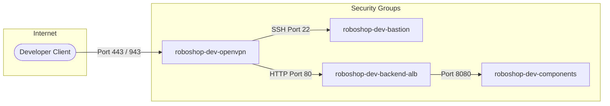
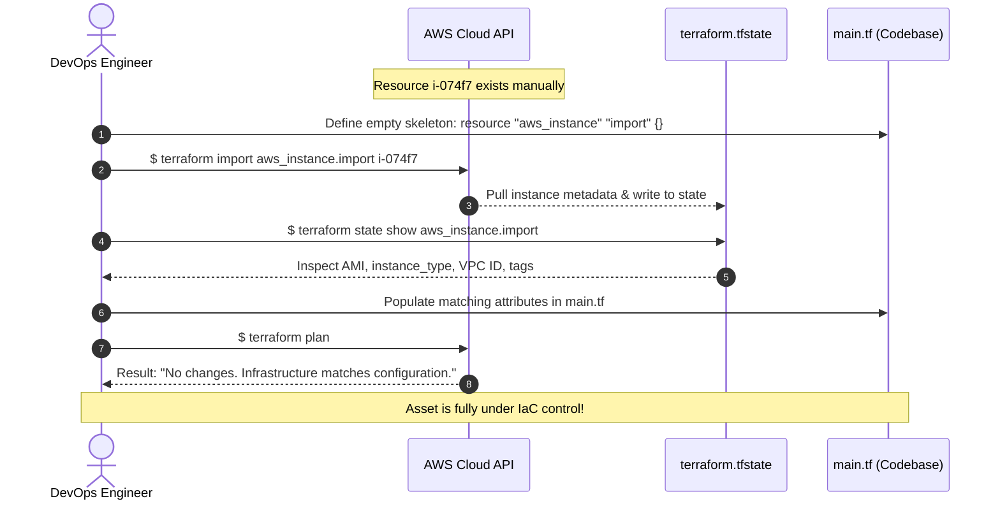

# Sunday, 29 March 2026
# Session 48 - Enterprise VPN Gateway (OpenVPN Access Server), Terraform Import (Brownfield IaC), `terraform -target`, `terraform taint` & Lifecycle Rules (`98-openvpn`)
## Comprehensive Class Notes, Secure Intra-VPC Tunnels & Advanced State Operations

---

## Table of Contents
1. [Class Running Notes & Foundational Concepts](#1-class-running-notes--foundational-concepts)
   - [Original Running Notes & Core Architecture Analogies](#original-running-notes--core-architecture-analogies)
   - [Enterprise Remote Access: Cisco AnyConnect vs OpenVPN Access Server](#enterprise-remote-access-cisco-anyconnect-vs-openvpn-access-server)
   - [Network Topologies: Bastion Host vs Client VPN vs AWS SSM Session Manager](#network-topologies-bastion-host-vs-client-vpn-vs-aws-ssm-session-manager)
   - [Stateless vs Stateful Workloads & Zero-Downtime Migration Patterns](#stateless-vs-stateful-workloads--zero-downtime-migration-patterns)
   - [Terraform Import Architecture: Reverse Engineering Brownfield Cloud Assets](#terraform-import-architecture-reverse-engineering-brownfield-cloud-assets)
   - [The Dangers of `terraform -target` & Dependency Graph Corruption](#the-dangers-of-terraform--target--dependency-graph-corruption)
   - [`terraform taint` vs Modern `terraform apply -replace`](#terraform-taint-vs-modern-terraform-apply--replace)
   - [Terraform Lifecycle Meta-Arguments (`create_before_destroy`, `prevent_destroy`, `ignore_changes`)](#terraform-lifecycle-meta-arguments-create_before_destroy-prevent_destroy-ignore_changes)
2. [Workspace Projects Mapping & Architecture](#2-workspace-projects-mapping--architecture)
   - [Directory Structure & Direct Workspace File Links](#directory-structure--direct-workspace-file-links)
   - [Architectural Mermaid & ASCII Diagrams](#architectural-mermaid--ascii-diagrams)
     - [A. OpenVPN Client-to-VPC Encrypted Tunnel Architecture](#a-openvpn-client-to-vpc-encrypted-tunnel-architecture)
     - [B. Security Group Trust Chaining: OpenVPN -> Bastion & Backend ALB](#b-security-group-trust-chaining-openvpn---bastion--backend-alb)
     - [C. Terraform Import State Reconciliation Lifecycle](#c-terraform-import-state-reconciliation-lifecycle)
     - [D. Lifecycle `create_before_destroy` vs Default `destroy_then_create` Flow](#d-lifecycle-create_before_destroy-vs-default-destroy_then_create-flow)
3. [Original AWS Console Step-by-Step Guides (Preserved Verbatim)](#3-original-aws-console-step-by-step-guides-preserved-verbatim)
   - [How to create Open VPN AWS instance Manually?](#how-to-create-open-vpn-aws-instance-manually)
   - [How to create Security Group for Open VPN AWS instance Manually?](#how-to-create-security-group-for-open-vpn-aws-instance-manually)
   - [How to create Rules for Open VPN AWS Security Group Manually? (Inbound 443, 22, 943)](#how-to-create-rules-for-open-vpn-aws-security-group-manually-inbound-443-22-943)
   - [How to create Rules for Bastion AWS Security Group Manually? (Allow SSH from OpenVPN SG)](#how-to-create-rules-for-bastion-aws-security-group-manually-allow-ssh-from-openvpn-sg)
4. [Chronological Hands-on Execution & Deployment Process](#4-chronological-hands-on-execution--deployment-process)
   - [Step 1: Deploy OpenVPN AMI & Configure Security Group Manually](#step-1-deploy-openvpn-ami--configure-security-group-manually)
   - [Step 2: Initial SSH Configuration Wizard & Admin Credential Initialization](#step-2-initial-ssh-configuration-wizard--admin-credential-initialization)
   - [Step 3: Web Admin UI Configuration (`https://<IP>:943/admin`)](#step-3-web-admin-ui-configuration-httpsip943admin)
   - [Step 4: OpenVPN Desktop Client Setup & Full Tunnel IP Verification](#step-4-openvpn-desktop-client-setup--full-tunnel-ip-verification)
   - [Step 5: Security Group Trust Chaining (Bastion & Backend ALB)](#step-5-security-group-trust-chaining-bastion--backend-alb)
   - [Step 6: Direct Browser Verification of Internal Microservices Over VPN](#step-6-direct-browser-verification-of-internal-microservices-over-vpn)
   - [Step 7: Manual Teardown & Terraform Automation Scaffolding (`98-openvpn`)](#step-7-manual-teardown--terraform-automation-scaffolding-98-openvpn)
   - [Step 8: Automated Bootstrapping via `vpn.sh` & OpenVPN `sacli` CLI](#step-8-automated-bootstrapping-via-vpnsh--openvpn-sacli-cli)
   - [Step 9: Deep Dive – Brownfield Terraform Import Workflow (`terraform/import/`)](#step-9-deep-dive--brownfield-terraform-import-workflow-terraformimport)
   - [Step 10: Hands-on with `terraform -target`, `terraform taint`, and Lifecycle Flags](#step-10-hands-on-with-terraform--target-terraform-taint-and-lifecycle-flags)
5. [End-to-End Line-by-Line Code Teardown](#5-end-to-end-line-by-line-code-teardown)
   - [Layer 1: OpenVPN Server Automation (`roboshop-infra-dev/98-openvpn/`)](#layer-1-openvpn-server-automation-roboshop-infra-dev98-openvpn)
     - [`provider.tf`](#providertf-in-98-openvpn)
     - [`data.tf`](#datatf-in-98-openvpn)
     - [`locals.tf`](#localstf-in-98-openvpn)
     - [`vpn.sh`](#vpnsh-in-98-openvpn)
     - [`main.tf`](#maintf-in-98-openvpn)
   - [Layer 2: Network Security Ingress Rules (`roboshop-infra-dev/20-sg-rules/main.tf`)](#layer-2-network-security-ingress-rules-roboshop-infra-dev20-sg-rulesmaintf)
   - [Layer 3: Terraform Import Architecture (`terraform/import/main.tf`)](#layer-3-terraform-import-architecture-terraformimportmaintf)
   - [Layer 4: Terraform Lifecycle Engine (`terraform/life-cycle/aws_ec2.tf`)](#layer-4-terraform-lifecycle-engine-terraformlife-cycleaws_ec2tf)
6. [Commands & CLI Reference Table](#6-commands--cli-reference-table)
7. [Official Documentation & Deep Technical References](#7-official-documentation--deep-technical-references)
8. [High-Yield Real-World Interview Questions & Deep Answers](#8-high-yield-real-world-interview-questions--deep-answers)
9. [Production Outage Case Study & Troubleshooting Playbook](#9-production-outage-case-study--troubleshooting-playbook)
10. [High-Impact LinkedIn Post Draft (Architecture & Gotchas)](#10-high-impact-linkedin-post-draft-architecture--gotchas)
11. [Session Metadata & Timestamps](#11-session-metadata--timestamps)

---

## 1. Class Running Notes & Foundational Concepts

### Original Running Notes & Core Architecture Analogies
*Captured directly from classroom discussions, interactive debugging scenarios, and architecture whiteboards:*

1. **Enterprise VPN Overview**:
   - In commercial Fortune 500 environments, enterprises commonly use proprietary gateways like **Cisco AnyConnect**, **Palo Alto GlobalProtect**, or **Fortinet FortiClient**.
   - In cloud-native and open-source ecosystems, **OpenVPN Access Server** is the industry standard for secure intra-VPC engineering tunnels.
2. **OpenVPN Access Server Community Image**:
   - AMI Name: `OpenVPN Access Server Community Image-8fbe3379-63b6-43e8-87bd-0e93fd7be8f3`
   - Canonical AMI ID: `ami-03ea534e3e9b6f519` (in `us-east-1`).
   - SSH Access Username: `openvpnas`
   - Admin Web UI Username: `openvpn`
3. **Brownfield vs Greenfield Cloud Infrastructure**:
   - **Greenfield**: Standard Terraform workflow where IaC code is written first, and Terraform creates the cloud resources:
     $$\text{Resource Definition (HCL)} \longrightarrow \text{Cloud Infrastructure (AWS)}$$
   - **Brownfield (Terraform Import)**: Existing resources were created manually via the AWS Console or scripts, and we need to bring them under Terraform state management without deleting or disrupting them:
     $$\text{Existing Cloud Infrastructure} \longrightarrow \text{Terraform State (.tfstate)} \longrightarrow \text{Resource Definition (HCL)}$$
   - This process is pure **Reverse Engineering**.
4. **The 4-Step Classic Import Formula**:
   - **Step 1**: Write a minimal skeleton block for the resource in `.tf` (e.g. `resource "aws_instance" "import" {}`).
   - **Step 2**: Execute `terraform import <resource-type>.<resource-name> <physical-cloud-id>` (e.g. `terraform import aws_instance.web i-12345678`).
   - **Step 3**: Inspect the imported state via `terraform.tfstate` or `terraform state show <resource-address>`.
   - **Step 4**: Copy and match the arguments into the HCL resource block until `terraform plan` outputs: *"No changes. Your infrastructure matches the configuration."*
5. **Stateless vs Stateful Migration Architecture**:
   - **Stateful**: State (data) is irreplaceable. Databases (MongoDB, MySQL, Redis) cannot be easily re-created without significant downtime or data loss. In large migrations, databases are brought into Terraform via `terraform import`.
   - **Stateless**: Application microservices (Frontend, Catalogue, Cart, User, Shipping, Payment) do not store persistent state locally on the instance disk. If an EC2 instance crashes or is destroyed, a replacement instance spin-up with Ansible/Docker restores full functionality in minutes.
   - **Parallel Blue/Green Migration Pattern**:
     $$\text{Dummy Route 53} \longrightarrow \text{New Frontend ALB} \longrightarrow \text{New Frontend EC2} \longrightarrow \text{New Backend ALB} \longrightarrow \text{New Components} \longrightarrow \text{Existing Database}$$
     Once validated, update production Route 53 to point to the new Frontend ALB with zero downtime!
6. **`terraform -target`**:
   - Allows targeted creation, refresh, or deletion of a specific resource address (e.g., `terraform destroy -target=aws_instance.web`).
   - **Crucial Warning**: Highly dangerous in team CI/CD pipelines because it isolates a node in the Directed Acyclic Graph (DAG), ignoring downstream dependencies and causing state drift.
7. **`terraform taint`**:
   - Analogy: *Taint = Paint / Pollute / Corrupt*.
   - Marks a specific resource as degraded or corrupted in the state file so that the next `terraform apply` forcefully destroys and recreates it.
8. **Terraform Lifecycle Meta-Arguments**:
   - `create_before_destroy = true`: Creates the replacement resource *before* destroying the running resource, preventing downtime during AMI upgrades.
   - `prevent_destroy = true`: Emits an error if anyone attempts to run `terraform destroy` on critical production datastores.
   - `ignore_changes = [tags, user_data]`: Prevents Terraform from attempting to revert modifications made by outside autoscaling agents or tagging bots.

---

### Enterprise Remote Access: Cisco AnyConnect vs OpenVPN Access Server

```
+──────────────────────────────────────────────────────────────────────────────────────────+
|                        ENTERPRISE REMOTE ACCESS COMPARISON                               |
+──────────────────────────────────────────────────────────────────────────────────────────+

 CISCO ANYCONNECT / PALO ALTO:
 [Enterprise Employee] ───> [Hardware Appliance / Corporate Edge] ───> [Corporate DC & AWS]
   • Enterprise license fees ($$$$)
   • Requires physical or specialized virtual appliances
   • Tied to Active Directory / RADIUS enterprise identity providers

 OPENVPN ACCESS SERVER (Cloud-Native):
 [Remote Engineer] ───> [OpenVPN EC2 Instance in Public Subnet] ───> [VPC Private Subnets]
   • Lightweight, open-source core with commercial Access Server management
   • Deployable directly from AWS Marketplace Community AMIs
   • Native Linux CLI administration via `sacli` (Scriptable Access Control CLI)
   • Easily automated via Terraform `user_data` and shell scripts
```

---

### Network Topologies: Bastion Host vs Client VPN vs AWS SSM Session Manager

| Feature | Bastion Host (Jump Box) | Client VPN (OpenVPN / AWS VPN) | AWS SSM Session Manager |
| :--- | :--- | :--- | :--- |
| **Connection Mechanism** | SSH tunnel over Port 22 | Encrypted OpenVPN tunnel (UDP 1194 / TCP 443) | HTTPS Port 443 via AWS Systems Manager Agent |
| **Client Software** | Standard Terminal / PuTTY | OpenVPN Connect GUI Client | AWS CLI + Session Manager Plugin |
| **Network Reach** | Terminal shell on Bastion only (requires SSH proxy jump for internal access) | **Full intra-VPC IP routing**: Can open private internal URLs (`http://catalogue...`) directly in local browser! | Shell / Port Forwarding without public IP |
| **Security Surface** | Port 22 exposed to public or office IP | UDP 1194 / TCP 943 exposed to public | Zero open inbound security group ports |
| **Primary Audience** | Sysadmins & DevOps engineers | Developers, QA, and Engineering teams needing web/DB access | Cloud Engineers & Automated pipelines |

---

### Stateless vs Stateful Workloads & Zero-Downtime Migration Patterns

```
+──────────────────────────────────────────────────────────────────────────────────────────+
|                        STATELESS vs STATEFUL INFRASTRUCTURE ARCHITECTURE                 |
+──────────────────────────────────────────────────────────────────────────────────────────+

 STATELESS SERVICES (Frontend, Catalogue, Cart, User, Shipping):
   ├── No local persistent disk storage
   ├── Instances are disposable (cattle, not pets)
   └── Replaced instantly via Auto Scaling, Blue/Green, or Terraform recreate

 STATEFUL SERVICES (MySQL, MongoDB, Redis, RabbitMQ):
   ├── Persistent storage on EBS volumes / Database clusters
   ├── Data loss occurs if instance or root volume is destroyed
   └── NEVER destroyed in-place! Managed via Terraform Import, Snapshots & Multi-AZ Replicas
```

During major infrastructure refactoring, teams create the entire stateless stack in parallel with temporary Route 53 records (`dummy.domain.com`), validate end-to-end communication with the stateful databases, and switch the primary Route 53 record to the new ALB during an approved maintenance window.

---

### Terraform Import Architecture: Reverse Engineering Brownfield Cloud Assets

```
+──────────────────────────────────────────────────────────────────────────────────────────+
|                         TERRAFORM IMPORT RECONCILIATION FLOW                             |
+──────────────────────────────────────────────────────────────────────────────────────────+

  1. Existing EC2 Instance (Created via AWS Console)
     ID: i-074f714a1cee05e12 (AMI, VPC, Subnet, Tags exist in AWS API)
           │
           │ $ terraform import aws_instance.import i-074f714a1cee05e12
           ▼
  2. Terraform State File (terraform.tfstate)
     State now contains all physical attributes (ami, instance_type, security_groups)
           │
           │ Inspect: $ terraform state show aws_instance.import
           ▼
  3. Declarative HCL Configuration (main.tf)
     Engineer drafts resource "aws_instance" "import" { ... } matching state attributes
           │
           │ Validate: $ terraform plan
           ▼
  4. Plan Convergence:
     "No changes. Your infrastructure matches the configuration."
     Asset is officially under Git & Terraform IaC governance!
```

---

### The Dangers of `terraform -target` & Dependency Graph Corruption

```
+──────────────────────────────────────────────────────────────────────────────────────────+
|                       THE TERRAFORM DIRECTED ACYCLIC GRAPH (DAG)                         |
+──────────────────────────────────────────────────────────────────────────────────────────+

   VPC ───> Subnets ───> Security Groups ───> ALB ───> Target Groups ───> EC2 Fleet
                                                                              ▲
                                                                              │
   [Targeted Operation: terraform destroy -target=aws_security_group.web] ─────┘
   
   CONSEQUENCES:
   1. If other resources reference the targeted security group, Terraform will error out
      or leave dangling references.
   2. Terraform skips refreshing un-targeted resources, hiding configuration drift.
   3. CI/CD automation pipelines MUST NEVER use -target in production merges!
```

> [!WARNING]
> **Production Rule on `-target`**: Use `-target` strictly as an emergency recovery tool (e.g., when a single resource has failed in a cyclical dependency deadlock and must be destroyed or created individually before a full `terraform apply`). Never commit `-target` commands into Jenkins, GitHub Actions, or GitLab CI pipelines!

---

### `terraform taint` vs Modern `terraform apply -replace`

- **Historic Command**: `terraform taint <resource_address>`
  - Modifies the state file immediately, marking the resource as "tainted".
  - *Risk*: Modifies state out-of-band before you run `terraform plan`.
- **Modern Recommended Workflow (Terraform v0.15.2+)**:
  ```bash
  terraform apply -replace="aws_instance.openvpn" -auto-approve
  ```
  - Leaves the state untouched during planning.
  - Allows you to run `terraform plan -replace="aws_instance.openvpn"` to preview the destruction and recreation before applying!

---

### Terraform Lifecycle Meta-Arguments (`create_before_destroy`, `prevent_destroy`, `ignore_changes`)

```
DEFAULT BEHAVIOR:
1. Terminate Old EC2 Instance ───> [DOWNTIME WINDOW] ───> 2. Launch New EC2 Instance

WITH `create_before_destroy = true`:
1. Launch New EC2 Instance ───> 2. Register with Target Group ───> 3. Terminate Old Instance
                                  (ZERO DOWNTIME!)
```

- **`create_before_destroy = true`**: Reverses the operational order for replacements. Vital for web servers, ASGs, and SSL certificates.
- **`prevent_destroy = true`**: Acts as a software safety lock. Any `terraform destroy` or speculative replacement fails immediately at plan time.
- **`ignore_changes = [tags, ami]`**: Prevents Terraform from reverting tags applied by AWS Cost Allocation tools or security scanners.

---

## 2. Workspace Projects Mapping & Architecture

### Directory Structure & Direct Workspace File Links
This session spans both the enterprise infrastructure repo (`roboshop-infra-dev`) and the core Terraform practice module (`terraform`):

```
/Users/sriramcharankolla/Desktop/DevOps/
├── roboshop-infra-dev/
│   ├── 10-sg/                                    # Security Group definitions (including openvpn SG)
│   ├── 20-sg-rules/                              # OpenVPN 443/943 ingress & Backend ALB trust rules
│   │   └── main.tf                               # [Lines 326-355: OpenVPN rules]
│   └── 98-openvpn/                               # Automated OpenVPN Access Server Layer
│       ├── provider.tf                           # S3 remote state key: roboshop-dev-openvpn
│       ├── data.tf                               # AMI lookup, SSM parameters for Subnet & SG
│       ├── locals.tf                             # AMI ID, first public subnet & common tags
│       ├── variables.tf                          # Project & environment variables
│       ├── vpn.sh                                # Automated boot script leveraging `sacli` CLI
│       ├── main.tf                               # aws_instance.openvpn resource definition
│       └── README.md                             # Comprehensive deployment & verification notes
└── terraform/
    ├── import/                                   # Brownfield Resource Import Playground
    │   ├── provider.tf                           # AWS Provider config
    │   └── main.tf                               # Classic vs Modern declarative import patterns
    └── life-cycle/                               # Terraform Lifecycle Meta-arguments
        ├── provider.tf                           # Local provider
        └── aws_ec2.tf                            # create_before_destroy & prevent_destroy examples
```

- Clickable Workspace Links:
  - [roboshop-infra-dev/98-openvpn/main.tf](../../roboshop-infra-dev/98-openvpn/main.tf)
  - [roboshop-infra-dev/98-openvpn/vpn.sh](../../roboshop-infra-dev/98-openvpn/vpn.sh)
  - [roboshop-infra-dev/98-openvpn/data.tf](../../roboshop-infra-dev/98-openvpn/data.tf)
  - [roboshop-infra-dev/98-openvpn/locals.tf](../../roboshop-infra-dev/98-openvpn/locals.tf)
  - [roboshop-infra-dev/98-openvpn/provider.tf](../../roboshop-infra-dev/98-openvpn/provider.tf)
  - [roboshop-infra-dev/20-sg-rules/main.tf](../../roboshop-infra-dev/20-sg-rules/main.tf)
  - [terraform/import/main.tf](../../terraform/import/main.tf)
  - [terraform/life-cycle/aws_ec2.tf](../../terraform/life-cycle/aws_ec2.tf)

---

### Architectural Mermaid & ASCII Diagrams

#### A. OpenVPN Client-to-VPC Encrypted Tunnel Architecture

```mermaid
flowchart TD
    Engineer([Developer Laptop at Home]) -->|1. Encrypted OpenVPN Tunnel: UDP 1194 / TCP 443| VPN_EC2[OpenVPN Access Server EC2<br/>Public Subnet us-east-1a]
    
    subgraph AWS VPC (10.0.0.0/16)
        VPN_EC2 -->|2. Reroute Gateway / Direct IP Routing| Router[VPC Route Table]
        
        subgraph Private Subnets (No Public IPs)
            Router -->|SSH Port 22| Bastion[Bastion Host]
            Router -->|HTTP Port 80| BALB[Internal Backend ALB]
            BALB -->|Port 8080| Microservices[Catalogue / User / Cart / Shipping]
            Microservices --> Databases[(MongoDB / Redis / MySQL / RabbitMQ)]
        end
    end
```

#### B. Security Group Trust Chaining: OpenVPN -> Bastion & Backend ALB



#### C. Terraform Import State Reconciliation Lifecycle



#### D. Lifecycle `create_before_destroy` vs Default `destroy_then_create` Flow

```
+──────────────────────────────────────────────────────────────────────────────────────────+
|                    TERRAFORM LIFECYCLE REPLACEMENT STATE MACHINE                         |
+──────────────────────────────────────────────────────────────────────────────────────────+

 DEFAULT LIFECYCLE:
 [Running Instance V1] ───> [Destroy V1] ───> [DOWN: 3-5 Mins] ───> [Create V2] ───> [Active V2]

 WITH `create_before_destroy = true`:
 [Running Instance V1] ───┬───> [Create Instance V2] ───> [Healthchecks Pass] ───> [Destroy V1]
                          └───> (Traffic seamlessly served by V1 during V2 launch!)
```

---

## 3. Original AWS Console Step-by-Step Guides (Preserved Verbatim)

*The exact step-by-step console instructions recorded during manual validation are preserved below in their entirety:*

### How to create Open VPN AWS instance Manually?
> Go AWS EC2 then in side menu click on “Instances” then click on “Lunch instances” button then in “Launch an instance” page under “Name and tags” enter “roboshop-dev-openvpn” for “Name” field then under “Application and OS Images (Amazon Machine Image)” click on “Browse more AMIs” in search bar search for “openvpn access” and click on “Community AMIs” tab then select this “OpenVPN Access Server Community Image-8fbe3379-63b6-43e8-87bd-0e93fd7be8f3” VPN by clicking on “Select” button. t3.small is minimum requirement for this AWS AMI Community image. Then under “Key pair (login)” select “key-pairs-you-have” for “Key pair name - required” then under “Network settings” click on “Edit” button then select “roboshop-dev” option for “VPC - required” then select “roboshop-dev-public-us-east-1a” option for “Subnet” then create a security group for VPN. After creating a security group for VPN then click on “Compare security group rules” refresh icon to get Open VPN SG in “Common security groups” dropdown list then select “roboshop-dev-opevpn” security group option for “Common security groups” then click on “Launch instance” button.

### How to create Security Group for Open VPN AWS instance Manually?
> Go AWS EC2 then in side menu under “Network & Security” click on “Security Groups” then click on “Create security group” button then in “Create security group” page under “Basic details” enter “roboshop-dev-openvpn” for “Security group name” field then enter “roboshop-dev-openvpn” for “Description” then select “roboshop-dev” option for “VPC” then click on “Create security group” button.

### How to create Rules for Open VPN AWS Security Group Manually? (Inbound 443, 22, 943)
> Once security group created successfully then click on “Edit inbound rules” button then click on “Add rule” button then select “Custom TCP” for “Type” then enter “443” for “Port range” to allow connections from outside to inside then click on “Save rules” button then agin click on “Add rule” button to enable connection from port number “22” so select “Custom TCP” for “Type” then enter “22” for “Port range” to enable connection then click on “Save rules” button then agin click on “Add rule” button to enable connection from port number “943” so select “Custom TCP” for “Type” then enter “943” for “Port range” to enable connection then click on “Save rules” button. Select inbond traffic with “0.0.0.0/0” for all rules.

### How to create Rules for Bastion AWS Security Group Manually? (Allow SSH from OpenVPN SG)
> Go to AWS EC2 security groups from side menu then search for “roboshop-dev-bastion” then select it then click on “Edit inbound rules” button then click on “Add rule” button then select “SSH” for “Type” then in “Source”(Custom) search for “roboshop-dev-openvpn” and select it then click on “Save rules” button.

---

## 4. Chronological Hands-on Execution & Deployment Process

The class followed a comprehensive execution journey: deploying OpenVPN manually in the AWS Console, completing interactive SSH configuration, connecting via OpenVPN client software, testing IP changes, updating Security Group rules to securely access private microservices directly from a local browser, tearing down manual assets, and automating everything in Terraform (`98-openvpn`) along with deep dives into `terraform import`, `terraform -target`, and `lifecycle` blocks.

### Step 1: Deploy OpenVPN AMI & Configure Security Group Manually
1. Launched an EC2 instance with the Community AMI:
   - `OpenVPN Access Server Community Image-8fbe3379-63b6-43e8-87bd-0e93fd7be8f3` (`ami-03ea534e3e9b6f519`).
   - Instance Type: `t3.small` (recommended minimum memory for OpenVPN AS daemons).
   - VPC: `roboshop-dev`, Subnet: `roboshop-dev-public-us-east-1a`.
2. Attached Security Group `roboshop-dev-openvpn` with inbound rules for:
   - `TCP 443` (HTTPS Web Admin & fallback client tunnel) from `0.0.0.0/0`.
   - `TCP 943` (Admin Web Server UI) from `0.0.0.0/0`.
   - `TCP 22` (SSH administrative access) from `0.0.0.0/0`.
   - `UDP 1194` (Primary high-performance OpenVPN data tunnel) from `0.0.0.0/0`.

### Step 2: Initial SSH Configuration Wizard & Admin Credential Initialization
1. Connected to the freshly booted OpenVPN instance via SSH:
   ```bash
   ssh -i <your-key.pem> openvpnas@<roboshop-dev-openvpn-public-IP>
   ```
2. The interactive OpenVPN Access Server initialization prompt triggered automatically:
   - *"Please enter 'yes' to indicate your agreement [no]:"* -> Typed **`yes`**.
   - Pressed **`ENTER`** to accept default ports and settings for all general prompts.
   - *"Should client traffic be routed by default through VPN? > Press ENTER for default [no]:"* -> Typed **`yes`** (forces all workstation traffic through the VPN gateway).
   - Pressed **`ENTER`** for all remaining defaults.
3. Set the administrative password for the `openvpn` user:
   - Entered a strong password (e.g., `Openvpn123` or `Openvpn@123`).
   - Confirmed the password.
4. Noted the generated management endpoints:
   - **Admin UI**: `https://<openvpn-public-ip>:943/admin`
   - **Client UI**: `https://<openvpn-public-ip>:943/`

### Step 3: Web Admin UI Configuration (`https://<IP>:943/admin`)
1. Opened Chrome and navigated to `https://<openvpn-public-ip>:943/admin`.
2. Logged in with username `openvpn` and the configured password.
3. Accepted the End User License Agreement (EULA).
4. Navigated to **Configuration** -> **Advanced Settings**:
   - Inspected DNS settings and set fallback DNS servers (`8.8.8.8`, `1.1.1.1`).
   - Verified VPN network routing and client subnet allocation (`172.27.224.0/20`).

### Step 4: OpenVPN Desktop Client Setup & Full Tunnel IP Verification
1. Downloaded the official **OpenVPN Connect Client** for macOS / Windows.
2. In the client software, selected **URL** and entered:
   ```
   https://<openvpn-public-ip>:943/
   ```
3. Authenticated using `openvpn` and downloaded/imported the auto-generated `.ovpn` profile.
4. **IP Verification Before Connection**:
   - Navigated to `https://www.whatismyip.com/`.
   - Noted the local ISP home/office public IP address and ISP name.
5. **Connected to OpenVPN**:
   - Toggled the OpenVPN Connect switch to **ON**.
   - Refreshed `https://www.whatismyip.com/`.
   - **Result**: The displayed public IP changed to the exact public IP address of the AWS EC2 OpenVPN instance (`roboshop-dev-openvpn`), and the location resolved to Ashburn / us-east-1!

### Step 5: Security Group Trust Chaining (Bastion & Backend ALB)
Initially, connecting to internal VPC resources failed because security groups blocked traffic from the OpenVPN security group:
1. **Bastion Host Access**:
   - Navigated to `roboshop-dev-bastion` Security Group in AWS Console.
   - Added an Inbound Rule: **SSH (Port 22)** with Source set to **`roboshop-dev-openvpn` Security Group ID**.
   - Verified that engineers connected to VPN can SSH directly to Bastion's private IP (`10.0.1.x`) without traversing the public internet!
2. **Backend ALB Access**:
   - Navigated to `roboshop-dev-backend-alb` Security Group.
   - Added an Inbound Rule: **HTTP (Port 80)** with Source set to **`roboshop-dev-openvpn` Security Group ID**.

### Step 6: Direct Browser Verification of Internal Microservices Over VPN
1. With OpenVPN connected, opened Google Chrome on the local workstation.
2. Navigated to internal microservice URLs:
   ```
   http://catalogue.backend-alb-dev.ramcharankola.in/health
   ```
3. **Result**: The browser immediately rendered the JSON health check output from Catalogue (`{"status":"healthy"}`)!
   - *Why this is powerful*: Without OpenVPN, developers had to SSH into Bastion and run `curl http://localhost:8080/`. With OpenVPN, developers can test microservices, internal Swagger documentation, and database GUIs (MongoDB Compass, MySQL Workbench) directly from their native workstations!

### Step 7: Manual Teardown & Terraform Automation Scaffolding (`98-openvpn`)
1. Terminated the manual EC2 instance and deleted the manually created security groups to prevent name collisions.
2. Scaffolded the automated Terraform directory:
   ```bash
   cd /Users/sriramcharankolla/Desktop/DevOps/roboshop-infra-dev/98-openvpn
   ```
3. Inspected `provider.tf`, `data.tf`, `locals.tf`, and `main.tf`.

### Step 8: Automated Bootstrapping via `vpn.sh` & OpenVPN `sacli` CLI
Rather than requiring manual SSH setup, the `vpn.sh` user-data script fully automates OpenVPN configuration via the `sacli` (Scriptable Access Control CLI) utility:
```bash
#!/bin/bash
set -euo pipefail

SCRIPTS="/usr/local/openvpn_as/scripts"
USERNAME="openvpn"
PASSWORD='Openvpn@123'

until curl -ks https://127.0.0.1:943/ >/dev/null 2>&1; do sleep 3; done

# 1. Accept EULA
$SCRIPTS/sacli --key 'eula_accepted' --value 'true' ConfigPut

# 2. Set Admin Password
$SCRIPTS/sacli --user "$USERNAME" --new_pass "$PASSWORD" SetLocalPassword
$SCRIPTS/sacli --user "$USERNAME" --key 'prop_superuser' --value 'true' UserPropPut

# 3. Configure Port & Protocol
$SCRIPTS/sacli --key 'vpn.server.port'     --value '1194' ConfigPut
$SCRIPTS/sacli --key 'vpn.server.protocol' --value 'udp'  ConfigPut

# 4. Configure DNS
$SCRIPTS/sacli --key 'vpn.client.dns.server_auto' --value 'true' ConfigPut
$SCRIPTS/sacli --key 'cs.prof.defaults.dns.0' --value '8.8.8.8' ConfigPut
$SCRIPTS/sacli --key 'cs.prof.defaults.dns.1' --value '1.1.1.1' ConfigPut

# 5. Route all client traffic through VPN
$SCRIPTS/sacli --key 'vpn.client.routing.reroute_gw' --value 'true' ConfigPut

systemctl restart openvpnas
$SCRIPTS/sacli ConfigSync
$SCRIPTS/sacli start
```
Executed Terraform deployment:
```bash
terraform init
terraform plan
terraform apply -auto-approve
```

### Step 9: Deep Dive – Brownfield Terraform Import Workflow (`terraform/import/`)
1. Navigated to the Terraform practice repository:
   ```bash
   cd /Users/sriramcharankolla/Desktop/DevOps/terraform/import
   terraform init
   ```
2. Executed classic import on an unmanaged AWS EC2 instance:
   ```bash
   terraform import aws_instance.import i-074f714a1cee05e12
   ```
3. Inspected the newly populated state:
   ```bash
   terraform state show aws_instance.import
   ```
4. Added the matching arguments (`ami`, `instance_type`, `tags`) into [`main.tf`](../../terraform/import/main.tf).
5. Executed `terraform plan` to confirm state alignment with zero pending changes.

### Step 10: Hands-on with `terraform -target`, `terraform taint`, and Lifecycle Flags
1. Tested targeted destruction:
   ```bash
   terraform destroy -target=aws_instance.import -auto-approve
   ```
2. Tested resource replacement via taint / modern `-replace`:
   ```bash
   # Historic approach
   terraform taint aws_instance.import
   
   # Modern recommended approach
   terraform apply -replace="aws_instance.import" -auto-approve
   ```
3. Validated lifecycle rules in [`terraform/life-cycle/aws_ec2.tf`](../../terraform/life-cycle/aws_ec2.tf) (`create_before_destroy = true`).

---

## 5. End-to-End Line-by-Line Code Teardown

### Layer 1: OpenVPN Server Automation (`roboshop-infra-dev/98-openvpn/`)

#### `provider.tf` in `98-openvpn`
> **File**: [roboshop-infra-dev/98-openvpn/provider.tf](../../roboshop-infra-dev/98-openvpn/provider.tf)

```hcl
1: terraform {
2:   required_providers {
3:     aws = {
4:       source = "hashicorp/aws"
5:       version = "6.33.0" # Terraform AWS provider version
6:     }
7:   }
8: 
9:   backend "s3" {
10:     bucket  = "devsecops-terraform-remote-state-662147645266"
11:     key     = "roboshop-dev-openvpn"
12:     region  = "us-east-1"
13:     encrypt = true
14:     use_lockfile   = true
15:   }
16: }
17: 
18: provider "aws" {
19:   region = "us-east-1"
20: }
```
- **Lines 9-16**: Dedicated S3 remote state key (`roboshop-dev-openvpn`) with native S3 state locking (`use_lockfile = true`), completely decoupling OpenVPN lifecycle from application code.

---

#### `data.tf` in `98-openvpn`
> **File**: [roboshop-infra-dev/98-openvpn/data.tf](../../roboshop-infra-dev/98-openvpn/data.tf)

```hcl
1: data "aws_ami" "openvpn" {
2:   most_recent      = true
3:   owners           = ["679593333241"]
4: 
5:   filter {
6:     name   = "name"
7:     values = ["OpenVPN Access Server Community Image-8fbe3379-*"]
8:   }
9: 
10:   filter {
11:     name   = "root-device-type"
12:     values = ["ebs"]
13:   }
14: 
15:   filter {
16:     name   = "virtualization-type"
17:     values = ["hvm"]
18:   }
19: }
20: 
21: data "aws_ssm_parameter" "public_subnet_ids" {
22:   name = "/${var.project}/${var.environment}/public_subnet_ids"
23: }
24: 
25: data "aws_ssm_parameter" "openvpn_sg_id" {
26:     name = "/${var.project}/${var.environment}/openvpn_sg_id"
27: }
```
- **Lines 1-19**: Dynamic AMI query for the official OpenVPN Access Server Community AMI published by AWS Marketplace account `679593333241`, filtering for HVM virtualization and EBS root devices.
- **Lines 21-27**: Queries AWS Systems Manager (SSM) Parameter Store to fetch the public subnet IDs and OpenVPN security group ID established during `00-vpc` and `10-sg`.

---

#### `locals.tf` in `98-openvpn`
> **File**: [roboshop-infra-dev/98-openvpn/locals.tf](../../roboshop-infra-dev/98-openvpn/locals.tf)

```hcl
1: locals {
2:   ami_id =  data.aws_ami.openvpn.id
3:   common_tags = {
4:     Project = var.project
5:     Environment = var.environment
6:     Terraform = "true"
7:   }
8:   # public subnet in 1a AZ
9:   public_subnet_id = split(",", data.aws_ssm_parameter.public_subnet_ids.value)[0]
10:   openvpn_sg_id = data.aws_ssm_parameter.openvpn_sg_id.value
11: }
```
- **Line 9**: Uses `split(",", ...)[0]` to parse comma-delimited public subnet IDs stored in SSM and select the first public subnet (`us-east-1a`) for VPN ingress.

---

#### `vpn.sh` in `98-openvpn`
> **File**: [roboshop-infra-dev/98-openvpn/vpn.sh](../../roboshop-infra-dev/98-openvpn/vpn.sh)

```bash
1: #!/bin/bash
2: set -euo pipefail
3: 
4: SCRIPTS="/usr/local/openvpn_as/scripts"
5: USERNAME="openvpn"
6: PASSWORD='Openvpn@123'   # Use SSM or Secrets Manager in production
7: 
8: # Wait until Access Server UI is ready
9: until curl -ks https://127.0.0.1:943/ >/dev/null 2>&1; do sleep 3; done
10: 
11: # 1. Accept the license agreement
12: $SCRIPTS/sacli --key 'eula_accepted' --value 'true' ConfigPut
13: 
14: # 2. Set admin user and password
15: $SCRIPTS/sacli --user "$USERNAME" --new_pass "$PASSWORD" SetLocalPassword
16: $SCRIPTS/sacli --user "$USERNAME" --key 'prop_superuser' --value 'true' UserPropPut
17: 
18: # 3. VPN port and protocol
19: $SCRIPTS/sacli --key 'vpn.server.port'     --value '1194' ConfigPut
20: $SCRIPTS/sacli --key 'vpn.server.protocol' --value 'udp'  ConfigPut
21: 
22: # 4. DNS configuration: use Access Server host DNS
23: $SCRIPTS/sacli --key 'vpn.client.dns.server_auto' --value 'true' ConfigPut
24: $SCRIPTS/sacli --key 'cs.prof.defaults.dns.0' --value '8.8.8.8' ConfigPut
25: $SCRIPTS/sacli --key 'cs.prof.defaults.dns.1' --value '1.1.1.1' ConfigPut
26: 
27: # 5. Route all client traffic through the VPN
28: $SCRIPTS/sacli --key 'vpn.client.routing.reroute_gw' --value 'true' ConfigPut
29: 
30: # 6. Block access to VPN server services from clients (your latest request)
31: $SCRIPTS/sacli --key 'vpn.server.routing.gateway_access' --value 'true' ConfigPut
32: 
33: systemctl restart openvpnas
34: 
35: # 7. Save and start
36: $SCRIPTS/sacli ConfigSync
37: $SCRIPTS/sacli start
```
- **Lines 8-9**: Liveness poll waiting for local web daemon on port 943 to initialize before executing CLI configuration commands.
- **Lines 12-28**: Programmatic automation of the initial manual setup wizard using the internal OpenVPN `sacli` utility.
- **Line 28**: `reroute_gw = true`: Sets default gateway redirection, ensuring client DNS queries and network traffic travel through the secure AWS VPC tunnel.

---

#### `main.tf` in `98-openvpn`
> **File**: [roboshop-infra-dev/98-openvpn/main.tf](../../roboshop-infra-dev/98-openvpn/main.tf)

```hcl
1: resource "aws_instance" "openvpn" {
2:   ami = local.ami_id
3:   instance_type = "t3.small"
4:   subnet_id = local.public_subnet_id
5:   vpc_security_group_ids = [local.openvpn_sg_id]
6:   user_data = file("vpn.sh")
7: 
8:   tags = merge(
9:     {
10:         Name = "${var.project}-${var.environment}-openvpn"
11:     },
12:     local.common_tags
13:   )
14: }
```
- **Lines 1-6**: Provisions the OpenVPN EC2 instance in the public subnet, attaching the dedicated OpenVPN security group and passing `vpn.sh` via `user_data` for hands-off zero-touch provisioning.

---

### Layer 2: Network Security Ingress Rules (`roboshop-infra-dev/20-sg-rules/main.tf`)
> **File**: [roboshop-infra-dev/20-sg-rules/main.tf](../../roboshop-infra-dev/20-sg-rules/main.tf)

```hcl
326: resource "aws_security_group_rule" "openvpn_public_443" { # OpenVPN allowing traffic or requests from public through port number 443
327:   type              = "ingress"
328:   from_port         = 443
329:   to_port           = 443
330:   protocol          = "tcp"
331:   cidr_blocks       = ["0.0.0.0/0"]
332:   security_group_id = local.openvpn_sg_id
333: }
334: 
335: resource "aws_security_group_rule" "openvpn_public_943" { # OpenVPN allowing traffic or requests from OpenVPN Client through port number 943
336:   type              = "ingress"
337:   from_port         = 943
338:   to_port           = 943
339:   protocol          = "tcp"
340:   cidr_blocks       = ["0.0.0.0/0"]
341:   security_group_id = local.openvpn_sg_id
342: }
343: 
344: resource "aws_security_group_rule" "backend_alb_openvpn" { # Backend ALB allowing traffic or requests from OpenVPN
345:   type              = "ingress"
346:   from_port         = 80
347:   to_port           = 80
348:   protocol          = "tcp"
349:   source_security_group_id = local.openvpn_sg_id
350:   security_group_id = local.backend_alb_sg_id
351: }
```
- **Lines 326-342**: Ingress rules allowing remote developers across the internet to reach the OpenVPN tunnel endpoints on ports 443 and 943.
- **Lines 344-351**: **Zero-Trust Chaining**: Authorizes HTTP (Port 80) traffic to the private Backend ALB **only if** the traffic originates from instances holding the `openvpn` security group ID (`source_security_group_id`). No private IP CIDRs are hardcoded!

---

### Layer 3: Terraform Import Architecture (`terraform/import/main.tf`)
> **File**: [terraform/import/main.tf](../../terraform/import/main.tf)

```hcl
1: # -----------------------------------------------------------------------------
2: # Terraform Resource Import
3: # -----------------------------------------------------------------------------
4: # Importing allows bringing existing (brownfield) cloud resources under Terraform
5: # management without destroying or recreating them.
6: # -----------------------------------------------------------------------------
7: 
8: resource "aws_instance" "import" {
9:   # After importing, populate the resource arguments to match existing infrastructure
10:   # (e.g., ami, instance_type, tags, etc.)
11: }
12: 
13: # -----------------------------------------------------------------------------
14: # Method 1: Classic CLI Import Workflow
15: # -----------------------------------------------------------------------------
16: # Step 1: Initialize Terraform:
17: #         $ terraform init
18: #
19: # Step 2: Import the existing EC2 instance into the Terraform state:
20: #         $ terraform import aws_instance.import <i-0123456789abcdef0>
21: #
22: # Step 3: Inspect the imported resource attributes in 'terraform.tfstate' or via:
23: #         $ terraform state show aws_instance.import
24: #
25: # Step 4: Add the matching arguments (ami, instance_type, tags) into this resource block
26: #         until 'terraform plan' shows: "No changes. Your infrastructure matches the configuration."
27: #
28: # Step 5: Format code cleanly:
29: #         $ terraform fmt
30: #
31: # -----------------------------------------------------------------------------
32: # Method 2: Modern Declarative Import (Terraform v1.5+)
33: # -----------------------------------------------------------------------------
34: # import {
35: #   to = aws_instance.import
36: #   id = "i-0123456789abcdef0"
37: # }
38: # Running 'terraform plan -generate-config-out=generated.tf' can even auto-generate
39: # the HCL configuration for you!
40: # -----------------------------------------------------------------------------
```
- **Lines 8-11**: Skeleton HCL resource block required before invoking CLI import.
- **Lines 32-39**: Demonstrates the modern Terraform v1.5+ declarative `import {}` block, which enables generating matching HCL files automatically via `terraform plan -generate-config-out=generated.tf`.

---

### Layer 4: Terraform Lifecycle Engine (`terraform/life-cycle/aws_ec2.tf`)
> **File**: [terraform/life-cycle/aws_ec2.tf](../../terraform/life-cycle/aws_ec2.tf)

```hcl
48:   lifecycle {
49:     create_before_destroy = true
50:     # prevent_destroy     = false # Set to true in production to prevent accidental deletions
51:     # ignore_changes      = [tags] # Useful if tags are managed by outside tools
52:   }
```
- **Line 49**: `create_before_destroy = true`: Inverts Terraform's default destroy-then-create order, spinning up the replacement EC2 or Security Group prior to tearing down the existing one.
- **Line 50**: `prevent_destroy`: Protects mission-critical stateful infrastructure (e.g. production databases or VPC internet gateways) from catastrophic accidental deletion during `terraform destroy`.
- **Line 51**: `ignore_changes`: Eliminates drift noise caused by external AWS systems modifying tags, auto-scaling capacities, or volume IOPS dynamically.

---

## 6. Commands & CLI Reference Table

| # | Command / Action | Working Directory | Description & Expected Output |
| :---: | :--- | :--- | :--- |
| **1** | `ssh -i <key.pem> openvpnas@<IP>` | Local Terminal | Connects to OpenVPN server on first boot to trigger interactive CLI wizard. |
| **2** | `curl -ks https://127.0.0.1:943/` | Inside OpenVPN EC2 | Verifies OpenVPN web service daemon is responsive before applying config. |
| **3** | `/usr/local/openvpn_as/scripts/sacli ConfigSync` | Inside OpenVPN EC2 | Synchronizes scriptable CLI configurations into the Access Server database. |
| **4** | `systemctl status openvpn-server@server.service` | Inside OpenVPN EC2 | Validates that the systemd OpenVPN service daemon is `active (running)`. |
| **5** | `cd roboshop-infra-dev/98-openvpn && terraform init` | `98-openvpn/` | Initializes S3 remote backend (`roboshop-dev-openvpn`) with native lockfile. |
| **6** | `terraform apply -auto-approve` | `98-openvpn/` | Provisions automated OpenVPN instance with `vpn.sh` user_data in public subnet. |
| **7** | `terraform import aws_instance.import <ID>` | `terraform/import/` | Imports existing AWS EC2 instance into Terraform state without recreation. |
| **8** | `terraform state show aws_instance.import` | `terraform/import/` | Inspects full attribute map (AMI, subnet, security groups) of imported resource. |
| **9** | `terraform plan -generate-config-out=gen.tf` | `terraform/import/` | (TF v1.5+) Automatically generates HCL code from declarative `import {}` block. |
| **10**| `terraform destroy -target=aws_instance.import` | `terraform/import/` | Selectively targets a single resource for destruction (anti-pattern in CI/CD!). |
| **11**| `terraform taint aws_instance.import` | Local Workspace | Marks resource in state as tainted, forcing recreation on next apply. |
| **12**| `terraform apply -replace="aws_instance.import"` | Local Workspace | (Modern v0.15.2+) Safely plans and executes targeted resource replacement. |
| **13**| `terraform fmt` | Any TF Directory | Rewrites HCL files to canonical format and indentation. |

---

## 7. Official Documentation & Deep Technical References

1. [OpenVPN Access Server Official Command Line Configuration Reference (`sacli`)](https://openvpn.net/as-docs/sacli.html)
2. [HashiCorp Terraform Documentation – Importing Infrastructure](https://developer.hashicorp.com/terraform/cli/import)
3. [HashiCorp Terraform Documentation – Declarative Import Blocks (v1.5+)](https://developer.hashicorp.com/terraform/language/import)
4. [HashiCorp Terraform Documentation – The `lifecycle` Meta-Argument](https://developer.hashicorp.com/terraform/language/meta-arguments/lifecycle)
5. [AWS Systems Manager Parameter Store User Guide](https://docs.aws.amazon.com/systems-manager/latest/userguide/systems-manager-parameter-store.html)

---

## 8. High-Yield Real-World Interview Questions & Deep Answers

### Q1: What is the difference between Greenfield and Brownfield cloud deployments, and how do you bring thousands of unmanaged AWS resources into Terraform?
**Answer:**
- **Greenfield**: Starting a new infrastructure project from scratch. Infrastructure is defined entirely in Terraform code first, and `terraform apply` provisions the resources.
- **Brownfield**: Existing cloud environments that were provisioned manually via the AWS Management Console, CLI scripts, or CloudFormation. Bringing them under Terraform requires **Terraform Import**:
  1. *Legacy CLI Method*: Create skeleton HCL resource blocks (`resource "aws_instance" "app" {}`), execute `terraform import aws_instance.app <id>`, inspect state via `terraform state show`, and backfill arguments until `terraform plan` produces zero diffs.
  2. *Modern Declarative Import (Terraform v1.5+)*: Use top-level `import { to = aws_instance.app; id = "i-xxxx" }` blocks, and run `terraform plan -generate-config-out=generated.tf`. Terraform automatically analyzes the live cloud API and writes the exact HCL resource block for you!
  3. *Enterprise Scale*: Tools like **`terraformer`** or **AWS CloudFormation IaC Generator** scan entire AWS accounts and generate both state and HCL definitions across hundreds of VPCs, subnets, and RDS instances in bulk.

---

### Q2: Why is `terraform -target` considered an anti-pattern in enterprise CI/CD pipelines? When is its usage acceptable?
**Answer:**
Terraform builds a complete Directed Acyclic Graph (DAG) of your infrastructure to calculate dependencies, provider configurations, and ordering.
- **Why it is an anti-pattern**: Using `-target` forces Terraform to operate on an isolated sub-graph. 
  - It ignores upstream and downstream dependencies.
  - It skips state refreshes for un-targeted resources, concealing configuration drift.
  - If committed into CI/CD scripts, subsequent pipeline runs may fail or delete untargeted dependent resources unexpectedly.
- **When it is acceptable**: Strictly for **disaster recovery** and **bootstrap deadlock resolution**. For instance:
  - When creating an S3 bucket and DynamoDB table intended for Terraform remote state backend in the very first run.
  - When fixing a corrupted resource that causes cyclic dependency deadlocks preventing a standard `terraform apply`.

---

### Q3: How does `terraform apply -replace` differ from `terraform taint`, and why did HashiCorp deprecate `terraform taint`?
**Answer:**
- **`terraform taint`** directly modifies the `.tfstate` file immediately upon execution, marking the resource as degraded before planning. If the engineer changes their mind or someone else triggers a pipeline run before the apply happens, the resource remains tainted, leading to unintended destructions.
- **`terraform apply -replace="<address>"`** does not mutate the state file beforehand. It functions as an execution-time directive. You can run `terraform plan -replace="<address>"` to review the exact diff before applying, making it idempotent, safe, and compatible with GitOps and CI/CD code reviews.

---

### Q4: How do you perform zero-downtime AMI replacements on critical web instances using Terraform?
**Answer:**
By default, Terraform adopts a **destroy-then-create** lifecycle strategy. When an AMI ID changes, Terraform terminates the existing EC2 instance, causing immediate downtime until the replacement instance boots up and completes its user-data initialization.
To achieve zero downtime:
1. In the `aws_instance` or `aws_launch_template` resource, configure:
   ```hcl
   lifecycle {
     create_before_destroy = true
   }
   ```
2. Terraform reverses the sequence: it provisions the new instance with the new AMI first.
3. Once the new instance is healthy and registered with the Application Load Balancer target group, Terraform terminates the old instance.
4. *Gotcha*: Ensure naming collisions are avoided (e.g. use `name_prefix` instead of static `name` attributes for resources like Security Groups and Launch Templates).

---

### Q5: In an enterprise DevSecOps setup, why configure OpenVPN for developer access instead of giving developers SSH access to Bastion hosts?
**Answer:**
- **Bastion Host Limitations**: Bastion provides only a command-line SSH jump point. Developers cannot easily view internal web apps (Swagger UI, internal ALBs, Kubernetes dashboards) or connect native graphical database clients (DBeaver, Compass, Lens) without complex local SSH port-forwarding tunnels (`ssh -L 8080:internal-alb:80`).
- **OpenVPN Architecture**: Establishes a true Layer 3 encrypted tunnel. It assigns the developer's laptop an internal IP address inside the VPN subnet and updates the routing table. Developers can query internal DNS names (`catalogue.backend-alb-dev...`) directly from their browser and native development tools.
- **Security & Auditing**: OpenVPN supports centralized corporate SSO (LDAP, Okta, SAML), multi-factor authentication (MFA), session expiration, and granular security group chaining to isolate environments (`dev`, `stage`, `prod`).

---

## 9. Production Outage Case Study & Troubleshooting Playbook

### Real-World Incident: The Accidental Production Database Teardown Averted by `prevent_destroy`
*Documented from production retrospectives:*
- **The Incident**: A junior engineer was refactoring database module identifiers in Terraform from `aws_db_instance.main` to `aws_db_instance.mysql_primary`. Because the HCL resource identifier changed without an explicit `moved {}` block or `terraform state mv`, Terraform interpreted this as destroying the existing Multi-AZ MySQL production database and creating a blank database from scratch!
- **How Disaster Was Prevented**: The senior team had enforced the following lifecycle block in the database module:
  ```hcl
  lifecycle {
    prevent_destroy = true
  }
  ```
- **The Result**: The CI/CD plan failed instantly with:
  `Error: Instance cannot be destroyed (resource has prevent_destroy set to true)`.
- **The Permanent Fix**: Used Terraform's declarative `moved {}` block:
  ```hcl
  moved {
    from = aws_db_instance.main
    to   = aws_db_instance.mysql_primary
  }
  ```
  Terraform updated the state address in memory without touching the live AWS database!

### OpenVPN & State Troubleshooting Matrix

```
+───────────────────────────+──────────────────────────────────────+─────────────────────────────────────────+
| Symptom                   | Root Cause                           | Resolution                              |
+───────────────────────────+──────────────────────────────────────+─────────────────────────────────────────+
| Connected to VPN but      | OpenVPN server routing missing       | Set `sacli --key                        |
| cannot reach internet     | default gateway redirect             | 'vpn.client.routing.reroute_gw'         |
|                           |                                      | --value 'true' ConfigPut`               |
+───────────────────────────+──────────────────────────────────────+─────────────────────────────────────────+
| Connected to VPN but      | Backend ALB Security Group missing   | Add Inbound HTTP 80 rule on Backend     |
| cannot open internal URLs | rule allowing traffic from OpenVPN SG| ALB SG with source = openvpn_sg_id      |
+───────────────────────────+──────────────────────────────────────+─────────────────────────────────────────+
| `terraform import` fails  | Resource skeleton block missing or   | Define empty skeleton block in main.tf; |
| with "No resource found"  | incorrect address passed             | verify AWS IAM permissions for Read     |
+───────────────────────────+──────────────────────────────────────+─────────────────────────────────────────+
| Replaced resource causes  | Old resource destroyed before new    | Add `lifecycle { create_before_destroy  |
| 5-minute outage on apply  | is registered with ALB               | = true }` to resource block             |
+───────────────────────────+──────────────────────────────────────+─────────────────────────────────────────+
| CI/CD pipeline fails with | Targeted apply bypassed dependency   | Eliminate -target from automated CI/CD  |
| missing dependency error  | graph updates in previous run        | scripts; run full sequential apply      |
+───────────────────────────+──────────────────────────────────────+─────────────────────────────────────────+
```

---

## 10. High-Impact LinkedIn Post Draft (Architecture & Gotchas)

```markdown
🔒 Beyond Bastion Hosts: Why Modern Cloud Teams Use OpenVPN + Terraform for Intra-VPC Engineering!

How do your developers access private databases and internal microservices in AWS?
For years, the default answer was: "SSH into the Bastion Jump Box and run curl."

Here is why that model breaks down at scale—and how automated OpenVPN + Terraform changes the game:

1️⃣ The Developer Experience Bottleneck:
A Bastion host gives you a Linux shell. But what happens when developers need to open internal Swagger API documentation, debug with MongoDB Compass, or query an internal Application Load Balancer in Chrome?
Running complex SSH local port-forwarding tunnels (`ssh -L 8080:...`) for 15 microservices is an operational nightmare.

2️⃣ The Layer-3 Solution: OpenVPN Access Server:
By deploying an automated OpenVPN server in a public subnet with automated `sacli` bootstrapping via Terraform `user_data`, engineers connect via OpenVPN desktop clients.
Traffic is securely tunneled over UDP 1194 directly into the VPC. Developers can open `http://catalogue.backend-alb-dev...` directly in their native browser!

3️⃣ Zero-Trust Security Group Chaining:
We NEVER open internal databases or Backend ALBs to broad CIDR ranges.
The Backend ALB accepts Port 80 traffic ONLY from the `openvpn` Security Group ID (`source_security_group_id`). If you disconnect from VPN, access vanishes instantly.

4️⃣ State Mastery: Terraform Import & Lifecycle Guards:
- Brownfield migrations? Use Terraform 1.5+ declarative `import {}` blocks with `-generate-config-out` instead of manual state surgeries.
- Zero-downtime AMI rolling updates? Always attach `lifecycle { create_before_destroy = true }`.
- Accidental DB terminations? Block them in code with `lifecycle { prevent_destroy = true }`.

What remote access pattern does your engineering team use: Bastion, VPN, or AWS SSM Session Manager?

#DevSecOps #AWS #Terraform #OpenVPN #CloudArchitecture #CyberSecurity #InfrastructureAsCode #DevOps
```

---

## 11. Session Metadata & Timestamps
- **Session Number**: 48
- **Date**: Sunday, 29 March 2026
- **Core Topics**: Enterprise VPN, OpenVPN Access Server Community Image, Network Security Group Trust Chaining, Brownfield Terraform Import, `terraform -target` risks, `terraform taint` vs `-replace`, Terraform Lifecycle meta-arguments (`create_before_destroy`, `prevent_destroy`, `ignore_changes`).
- **Timestamps Recorded**:
  - `00:40:26`: Terraform Import Architecture & Hands-on
  - `01:08:10`: Real-world Interview Questions & Stateful Workload Migration
  - `01:15:52`: Interview Deep Dive – The Dangers of `terraform -target`
  - `01:26:46`: Q&A & Lifecycle Policies
- **Repositories Modified**:
  - [roboshop-infra-dev/98-openvpn/](../../roboshop-infra-dev/98-openvpn)
  - [roboshop-infra-dev/20-sg-rules/](../../roboshop-infra-dev/20-sg-rules)
  - [terraform/import/](../../terraform/import)
  - [terraform/life-cycle/](../../terraform/life-cycle)